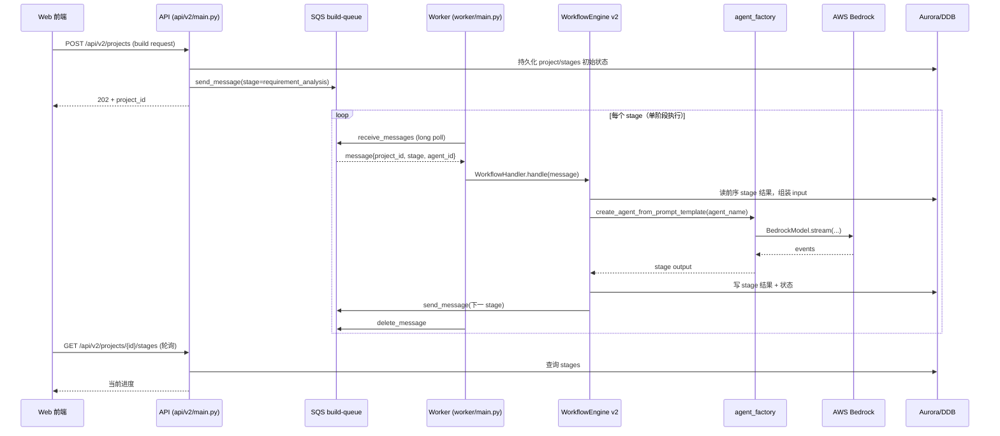

# 架构总览

## 概述

Nexus-AI 是一个基于 **AWS Bedrock + Strands Agents** 的开源 AI Agent 开发平台。整个平台由 **5 个核心服务 + 2 个可选服务**组成：API、Worker、Web、Gateway、Bridge 为核心；MCP Server 与 Event Scheduler 按需启用。所有服务通过 `nexus-cli` 脚本统一管理。

平台的中枢职责在两处：

1. **API（`api/v2/main.py`）**：FastAPI + Uvicorn，承载 35+ 个路由（身份认证、项目/Agent/会话 CRUD、SSE 流式对话、Agent 构建控制、可观测性），对前端暴露 REST；长时任务通过 SQS 投递给 Worker。
2. **Agent 实例化层（`nexus_utils/agent_factory.py`、`nexus_utils/magician.py`）**：Strands Agent 的构造入口，从 YAML 模板加载 system prompt，创建多提供商模型（Bedrock/OpenAI/Anthropic/LiteLLM/Ollama/Gemini），将 `@tool` 装饰函数注入到 Agent，同时支持 Graph / Swarm 多 Agent 编排。

数据层采用**三库分层**：**Aurora PostgreSQL Serverless v2**（关系型数据 12 张表）、**DynamoDB**（KV 数据 18 张表）、**ElastiCache Valkey Serverless**（缓存 + Stream 事件缓冲）。Agent 构建产物、会话文件、多模态内容落到 **S3**。异步任务通过 **SQS** 分发。

## 服务拓扑与通信

```
┌─────────────┐     HTTP/REST      ┌─────────────┐     SQS 消息      ┌─────────────┐
│  Web 前端   │ ──────────────────→ │  API 后端   │ ──────────────→  │   Worker    │
│  Next.js 14 │ ←── SSE 流式响应 ── │  FastAPI    │                  │  异步任务    │
│  :3000      │                     │  :8000      │                  │  处理器      │
└─────────────┘                     └──────┬──────┘                  └──────┬──────┘
                                           │                                │
                                           │  Python 内部调用                │
                                           ▼                                ▼
                                    ┌──────────────┐                ┌──────────────┐
                                    │ agent_factory│                │ agent_factory│
                                    │ Strands Agent│                │ Strands Agent│
                                    └──────┬───────┘                └──────┬───────┘
                                           │                               │
                                           ▼                               ▼
                                    ┌─────────────────────────────────────────────┐
                                    │              AWS Bedrock (Claude)            │
                                    └─────────────────────────────────────────────┘

┌─────────────┐     MCP 协议
│  MCP Server │ ←── Kiro / Claude Code / Cursor
│  FastMCP    │     （直接调用 agent_factory，不经过 API）
│  :9000      │
└─────────────┘
```

### 服务清单

| 服务 | 入口模块 | 技术栈 | 端口 | 职责 |
|------|----------|--------|------|------|
| API 后端 | `api/v2/main.py` | FastAPI + Uvicorn | 8000 | REST API、JWT 认证、SSO、SSE 流式对话、数据 CRUD |
| Worker | `worker/main.py` | Python + SQS long polling | — | Agent 构建/部署/通知工作流，单阶段执行模型 |
| Web 前端 | `web/` | Next.js 14 + React 18 + TypeScript + Tailwind | 3000 | 用户界面、TanStack Query、i18n |
| Gateway | `nexus_utils/gateway/__main__.py` | Stream proxy + Valkey | — | 流式代理、WebSocket、断点续播 |
| Bridge | `nexus_utils/bridge/` | Python | 8001 | 远程服务器连接管理器（SSH 能力） |
| MCP Server（可选） | `nexus_utils/mcp/mcp_server/__main__.py` | FastMCP 3.x | 9000 | 将 Agent 以 MCP Tool 暴露给 IDE |
| Event Scheduler（可选） | `nexus_utils/event_scheduler/` | Python + cron | — | 定时任务执行 |

### 服务间协议

| 链路 | 协议 | 说明 |
|------|------|------|
| Web → API | HTTP/REST + SSE | 数据查询、流式对话 |
| API → Worker | SQS | 异步任务分发（构建、部署、通知） |
| Worker → Aurora/DDB | AWS SDK | 状态与结果持久化 |
| API → Gateway | HTTP/SSE | 流式代理（Valkey Stream 缓冲） |
| MCP Client → MCP Server | MCP (Streamable HTTP) | Bearer Token 认证 |
| MCP Server → `agent_factory` | Python 内部调用 | 直接实例化 Strands Agent，不经过 API |

## 文件组织（File Layout）

| 路径 | 责任 | 依赖 |
|------|------|------|
| `CLAUDE.md` | Claude Code 工作指南（开发约定、命令、架构摘要） | 无 |
| `README.md` | 项目总入口（中文版，含快速开始、部署、路线图） | 无 |
| `api/v2/main.py` | FastAPI 应用入口，注册所有 router 和中间件 | `api/v2/config.py`、`api/v2/routers/*`、`api/v2/database` |
| `api/v2/config.py` | Pydantic `Settings` + DDB 表名常量 + SQS 队列常量 | `nexus_utils/config_loader.py` |
| `api/v2/routers/` | HTTP 路由（35+ 个 router 模块） | `api/v2/services/` |
| `api/v2/services/` | 业务逻辑（28+ 服务类） | `api/v2/database/` |
| `api/v2/database/` | DDB / SQS / Aurora 客户端封装，连接池 + 重试 | `boto3` |
| `api/v2/auth/middleware.py` | 全局认证中间件 | JWT、SAML |
| `worker/main.py` | Worker 主循环、SQS 长轮询、心跳、信号处理 | `worker/handlers/workflow_handler.py`、`api/v2/database.sqs_client` |
| `worker/handlers/` | `WorkflowHandler`、`BuildHandler` | `nexus_utils/workflow/engine_v2.py` |
| `nexus_utils/agent_factory.py` | Strands Agent 工厂、YAML 模板加载、多提供商模型 | `strands`、`nexus_utils/prompts_manager.py`、`nexus_utils/config_loader.py` |
| `nexus_utils/magician.py` | 单意图 Agent 编排器（agent / graph / swarm） | `agent_factory`、`strands.multiagent` |
| `nexus_utils/workflow/engine_v2.py` | 工作流引擎，SQS 驱动单阶段执行 + fork/join | `agent_factory`、Aurora DDB |
| `nexus_utils/config_loader.py` | 配置加载器（env > yaml > defaults） | `config/default_config.yaml`、`config/service_config.yaml` |
| `nexus_utils/observability/` | OpenTelemetry 初始化、指标、FastAPI 自动插桩 | `opentelemetry-*` |
| `nexus_utils/mcp/mcp_server/` | FastMCP Server，将 Agent 注册为 MCP Tool | `agent_factory`、`fastmcp` |
| `nexus_utils/mcp/mcp_client/` | MCP 客户端（Agent 调用外部 MCP 服务器） | — |
| `nexus_utils/gateway/` | 流式代理（Valkey Stream Relay） | `valkey` |
| `nexus_utils/bridge/` | 远程连接管理（多服务器、并行执行、命令权限） | `paramiko`/SSH |
| `nexus_utils/sandbox/` | Firecracker microVM Sandbox 运行时 | EC2 + KVM |
| `nexus_utils/event_scheduler/` | Cron 式定时任务执行 | `apscheduler` |
| `agents/system_agents/` | 系统核心 Agent（magician、agent_build_workflow 等） | `agent_factory` |
| `agents/template_agents/` | Agent 模板 | — |
| `agents/generated_agents/` | Agent 构建产物（自动生成） | — |
| `tools/system_tools/` | 系统工具（带 `@tool` 装饰器） | `strands.tool` |
| `tools/template_tools/` | 工具模板 | — |
| `tools/generated_tools/` | 生成的工具（需要时从 S3 同步到本地） | S3 |
| `prompts/` | YAML 提示词模板（`agent.versions[].system_prompt`） | — |
| `config/default_config.yaml` | 主配置（AWS、Bedrock、SQS、DDB、附件、模板等） | — |
| `config/service_config.yaml` | 运行时参数（线程池、超时、worker 数） | — |
| `config/workflows.yaml` | 工作流定义（`agent_build` / `agent_update` / `tool_build` / `skill_build` / `magician`） | — |
| `config/mcp/system_mcp_server.json` | 预配置 AWS MCP 服务器 | — |
| `config/mcp/public_mcp_server.json` | 用户自定义 MCP 服务器 | — |
| `architecture/` | 架构图（PNG 资源） | — |
| `web/` | Next.js 14 前端工程 | `next`、`react`、`@tanstack/query` |
| `infrastructure/` | Terraform + Docker + CloudFormation 模板 | — |
| `nexus-cli` | Shell 入口，分派子命令到 `scripts/` 与服务管理器 | bash |

## 核心类型 / 类

### `Settings` (`api/v2/config.py:1179`)

基于 `pydantic_settings.BaseSettings`。配置加载优先级：**环境变量 > `config/default_config.yaml` > 代码默认值**。通过 `@lru_cache` 缓存；`get_settings()` 会强制把 `AWS_REGION` 回写为 yaml 中的值，以防止同名环境变量劫持。

| 字段（摘录） | 类型 | 默认 | 说明 |
|---|---|---|---|
| `APP_NAME` | `str` | `"Nexus-AI API"` | 应用名 |
| `APP_VERSION` | `str` | `"0.1.0"` | 版本号，健康检查输出此字段 |
| `DEBUG` | `bool` | `False` | 调试标志 |
| `AWS_REGION` | `str` | `aws.aws_region_name` | AWS 区域（强制以 yaml 为准） |
| `AWS_ACCESS_KEY_ID` | `Optional[str]` | `None` | 覆盖 yaml 中 `aws_access_key_id` |
| `AWS_SECRET_ACCESS_KEY` | `Optional[str]` | `None` | 同上 |
| `DYNAMODB_ENDPOINT_URL` | `Optional[str]` | `None` | 用于 Local DDB |
| `DYNAMODB_TABLE_PREFIX` | `str` | `"nexus_"` | 所有表名前缀 |
| `SQS_ENDPOINT_URL` | `Optional[str]` | `None` | 自定义 SQS endpoint |
| `SQS_BUILD_QUEUE_NAME` | `str` | `"{prefix}build-queue"` | 构建队列 |
| `SQS_DEPLOY_QUEUE_NAME` | `str` | `"{prefix}deploy-queue"` | 部署队列 |
| `SQS_NOTIFICATION_QUEUE_NAME` | `str` | `"{prefix}notification-queue"` | 通知队列 |
| `SQS_BUILD_DLQ_NAME` / `SQS_DEPLOY_DLQ_NAME` | `str` | `"{prefix}build-dlq"` / `"{prefix}deploy-dlq"` | 死信队列 |
| `BUILD_VISIBILITY_TIMEOUT` | `int` | `3600` | 构建任务 SQS 可见性超时（秒） |
| `DEPLOY_VISIBILITY_TIMEOUT` | `int` | `600` | 部署任务可见性超时 |
| `MESSAGE_RETENTION_DAYS` | `int` | `14` | 消息保留天数 |
| `MAX_RETRY_COUNT` | `int` | `3` | 最大重试 |
| `AGENTCORE_REGION` | `Optional[str]` | `aws.aws_region_name` | AgentCore 部署区域 |
| `AGENTCORE_DEPLOY_DRY_RUN` | `bool` | `False` | 仅打印不执行部署 |
| `AGENTCORE_DEFAULT_ALIAS` | `str` | `"DEFAULT"` | AgentCore 别名 |
| `AGENTCORE_EXECUTION_ROLE_NAME` | `Optional[str]` | `None` | 执行角色 ARN |
| `AGENTCORE_AUTO_CREATE_EXECUTION_ROLE` | `bool` | `True` | 自动创建 IAM role |
| `AGENTCORE_AUTO_CREATE_ECR` | `bool` | `True` | 自动创建 ECR 仓库 |
| `AGENTCORE_POST_DEPLOY_TEST` | `bool` | `False` | 部署后执行冒烟测试 |
| `AGENTCORE_POST_DEPLOY_TEST_PROMPT` | `str` | `"Hello"` | 冒烟测试 prompt |
| `AGENTCORE_AUTO_UPDATE_ON_CONFLICT` | `bool` | `True` | 冲突时自动更新 |
| `AGENTCORE_REQUIREMENTS_PATH` | `str` | `"requirements.txt"` | 依赖清单 |
| `AGENTCORE_IMAGE_TAG_TEMPLATE` | `str` | `"{agent_name}:{timestamp}"` | 镜像 tag 模板 |
| `SESSION_STORAGE_S3_BUCKET` | `Optional[str]` | `None` | 会话存储 S3 桶 |
| `SESSION_STORAGE_S3_PREFIX` | `str` | `"sessions/"` | 前缀 |
| `CONVERSATION_MANAGER_ENABLED` | `bool` | `True` | 会话管理器总开关 |
| `CONVERSATION_MANAGER_TYPE` | `str` | `"sliding_window"` | `sliding_window` 或 `summarizing` |
| `CM_SLIDING_WINDOW_SIZE` | `int` | `40` | 滑窗大小 |
| `CM_SLIDING_TRUNCATE_RESULTS` | `bool` | `True` | 是否截断工具输出 |
| `CM_SUMMARY_RATIO` | `float` | `0.3` | 总结比例 |
| `CM_PRESERVE_RECENT_MESSAGES` | `int` | `10` | 最近保留消息数 |
| `CM_USE_CUSTOM_AGENT` | `bool` | `True` | 使用自定义总结 Agent |
| `CM_CUSTOM_AGENT_MODEL_ID` | `str` | `"us.anthropic.claude-haiku-4-5-20251001-v1:0"` | 总结模型 |
| `CM_CUSTOM_AGENT_PROMPT_PATH` | `str` | `"system_agents_prompts/conversation_summarizer/conversation_summarizer"` | 总结 prompt 路径 |
| `ATTACHMENT_S3_BUCKET` | `str` | `"nexus-ai-attachments"` | 附件桶 |
| `ATTACHMENT_PRESIGNED_URL_EXPIRY` | `int` | `3600` | 预签名 URL 过期秒数 |
| `ATTACHMENT_UPLOAD_URL_EXPIRY` | `int` | `600` | 上传 URL 过期秒数 |
| `ATTACHMENT_MAX_FILE_SIZE` | `int` | `50 * 1024 * 1024` | 单文件 50MB |
| `ATTACHMENT_MAX_FILES_PER_MESSAGE` | `int` | `5` | 单消息附件数上限 |
| `TEMPLATE_S3_BUCKET` | `str` | `templates.s3_bucket` 或附件桶 | 模板仓库 |
| `TEMPLATE_S3_KEY_PREFIX` | `str` | `"templates/"` | 前缀 |
| `TEMPLATE_EFS_SUBDIR` | `str` | `"/templates"` | EFS 子目录 |
| `TEMPLATE_LOCAL_CACHE_DIR` | `str` | `""` | 本地缓存目录（无 EFS 场景） |
| `TEMPLATE_UPLOAD_URL_EXPIRY` | `int` | `600` | 上传 URL 过期秒数 |
| `TEMPLATE_MAX_FILE_SIZE` | `int` | `100 * 1024 * 1024` | 100MB |
| `TEMPLATE_ALLOWED_EXTENSIONS` | `list` | `['pptx','docx','xlsx','pdf','html','htm','md','txt','png','jpg']` | 允许扩展名 |
| `TEMPLATE_PREVIEW_TEXT_MAX_BYTES` | `int` | `100 * 1024` | 预览文字上限 |
| `TEMPLATE_PREVIEW_WORKERS` | `int` | `4` | 预览并发 |
| `TEMPLATE_AI_ENABLED` | `bool` | `True` | 模板 AI 功能开关 |
| `TEMPLATE_AI_ANALYZE_MODEL` | `str` | `"us.anthropic.claude-haiku-4-5-20251001-v1:0"` | 分析模型 |
| `TEMPLATE_AI_EMBED_MODEL` | `str` | `"amazon.titan-embed-text-v2:0"` | Embedding 模型 |
| `TEMPLATE_AI_EMBED_DIM` | `int` | `1024` | Embedding 维度 |
| `TEMPLATE_AI_DIFF_MODEL` | `str` | `"us.anthropic.claude-haiku-4-5-20251001-v1:0"` | diff 模型 |
| `TEMPLATE_LIBREOFFICE_BIN` | `str` | `"libreoffice"` | 文档转换二进制 |
| `TEMPLATE_IMAGEMAGICK_BIN` | `str` | `"convert"` | 图像转换 |
| `TEMPLATE_TRIAL_AGENT_ID` | `str` | `"featured_deep_research"` | 试用 Agent ID |
| `SKILL_S3_BUCKET` | `str` | `artifacts_s3_bucket` 或 `"nexus-ai-artifacts-2026"` | Skill 存储（已并入 artifacts） |
| `CORS_ORIGINS` | `list` | `["*"]` | CORS origins |
| `CORS_ALLOW_CREDENTIALS` | `bool` | `False` | CORS 凭证 |
| `LOG_LEVEL` | `str` | `logging.level` | 日志级别 |

### DDB 表名常量 (`api/v2/config.py:1305`)

**18 张保留在 DDB 的表**（`api/v2/config.py:ALL_TABLES`，标记 `[Aurora-migrated]` 的已迁移至 Aurora，常量仅为向后兼容）：

| 常量 | 默认表名（带前缀） | 状态 |
|------|--------------------|------|
| `TABLE_PROJECTS` | `nexus_projects` | [Aurora-migrated] |
| `TABLE_STAGES` | `nexus_stages` | [Aurora-migrated] |
| `TABLE_AGENTS` | `nexus_agents` | [Aurora-migrated] |
| `TABLE_INVOCATIONS` | `nexus_invocations` | [Aurora-migrated] |
| `TABLE_SESSIONS` | `nexus_sessions` | [Aurora-migrated] |
| `TABLE_MESSAGES` | `nexus_messages` | [Aurora-migrated] |
| `TABLE_ATTACHMENTS` | `nexus_attachments` | [Aurora-migrated] |
| `TABLE_USERS` | `nexus_users` | [Aurora-migrated] |
| `TABLE_FAVORITES` | `nexus_favorites` | [Aurora-migrated] |
| `TABLE_SKILLS` | `nexus_skills` | [Aurora-migrated] |
| `TABLE_SKILL_GROUPS` | `nexus_skill_groups` | [Aurora-migrated] |
| `TABLE_GROUPS` | `nexus_groups` | [Aurora-migrated] |
| `TABLE_TASKS` | `nexus_tasks` | DDB |
| `TABLE_TOOLS` | `nexus_tools` | DDB |
| `TABLE_CLARIFICATIONS` | `nexus_clarifications` | DDB |
| `TABLE_DYNAMIC_CONFIGS` | `nexus_dynamic_configs` | DDB |
| `TABLE_EVENT_JOBS` | `nexus_event_jobs` | DDB |
| `TABLE_EVENT_TASKS` | `nexus_event_tasks` | DDB |
| `TABLE_REMOTE_CONNECTIONS` | `nexus_remote_connections` | DDB |
| `TABLE_CONNECTORS` | `nexus_connectors` | DDB |
| `TABLE_KEYS` | `nexus_keys` | DDB |
| `TABLE_KEY_USAGE_LOGS` | `nexus_key_usage_logs` | DDB |
| `TABLE_DIRECTIVES` | `nexus_directives` | DDB |
| `TABLE_POLICIES` | `nexus_policies` | DDB |
| `TABLE_AUDIT_LOGS` | `nexus_audit_logs` | DDB |
| `TABLE_MCP_SERVERS` | `nexus_mcp_servers` | DDB |
| `TABLE_SYSTEM_CONFIGS` | `nexus_system_configs` | DDB |
| `TABLE_BACKUP_SHARES` | `nexus_backup_shares` | DDB |
| `TABLE_FILE_SHARES` | `nexus_file_shares` | DDB |
| `TABLE_BRIDGE_COMMAND_RULES` | `nexus_bridge_command_rules` | DDB |
| `TABLE_SANDBOX_INSTANCES` | `nexus_sandbox_instances` | DDB |
| `TABLE_SANDBOX_LOGS` | `nexus_sandbox_logs` | DDB |
| `TABLE_SANDBOX_NODES` | `nexus_sandbox_nodes` | DDB |
| `TABLE_SESSION_TEMPLATE_BINDINGS` | `nexus_session_template_bindings` | DDB |

> 路由由 `api/v2/database/dynamodb.py::_setup_aurora_proxy()` 自动分派：Aurora-migrated 表的 CRUD 会透明代理到 `pg_client`。

### `Worker` (`worker/main.py:1448`)

Worker 主循环。每个 Worker 进程绑定**一个**队列类型（`build` 或 `deploy`）。

| 字段 | 类型 | 说明 |
|------|------|------|
| `queue_type` | `str` | `"build"` 或 `"deploy"` |
| `worker_id` | `str` | `worker_settings.WORKER_ID` |
| `running` | `bool` | 运行标志 |
| `_shutdown_event` | `threading.Event` | 关停信号 |
| `queue_name` | `str` | 根据 `queue_type` 选择的队列名 |
| `handler` | `WorkflowHandler \| None` | `build` 队列使用 `WorkflowHandler()`；`deploy` 处理器尚未实现 |
| `visibility_timeout` | `int` | `build` 继承 `worker_settings.VISIBILITY_TIMEOUT`；`deploy` 硬编码 `600` |

核心方法：

| 方法 | 签名 | 职责 |
|------|------|------|
| `start` | `start(self, once: bool = False)` | 进入主循环，注册 SIGINT/SIGTERM，循环 `_poll_and_process()`；`once=True` 时轮询一次即退出（测试模式） |
| `stop` | `stop(self)` | 设置 `running=False` 与 `_shutdown_event.set()` |
| `_signal_handler` | `_signal_handler(self, signum, frame)` | 第一次优雅停机，第二次 `sys.exit(1)` 强退 |
| `_poll_and_process` | `_poll_and_process(self)` | `sqs_client.receive_messages` 长轮询；空队列输出 `[POLL] ...: None` |
| `_process_message` | `_process_message(self, message: dict)` | 启动心跳线程、调用 `self.handler.handle(message)`、成功则 `delete_message` |
| `_start_heartbeat` | `_start_heartbeat(self, receipt_handle: str) -> Optional[threading.Timer]` | 起守护线程周期性 `change_message_visibility` 延长 visibility，防止长任务超时 |

### `Magician` (`nexus_utils/magician.py:2239`)

单意图 Agent 编排器。构造时将用户输入喂给 `magician_orchestrator` agent，由其决策 `orchestration_type`（`agent` / `graph` / `swarm`），然后动态构建相应执行器。

| 属性 | 类型 | 说明 |
|------|------|------|
| `_agent_cache` | `dict`（类级） | 基于 `(template_path, nocallback, custom_params)` 的 Agent 实例缓存 |
| `magician_agent` | `Agent` | Magician 本身的编排 Agent |
| `user_input` | `str` | 用户原始输入 |
| `thinking_result` | `Any` | 编排 Agent 对输入的首轮响应 |
| `orchestration_result` | `AgentOrchestrationResult` | `build_magician_agent()` 后填充 |

核心方法：

| 方法 | 签名 | 职责 |
|------|------|------|
| `build_magician_agent` | `build_magician_agent(self)` | 调用 `structured_output(AgentOrchestrationResult, ...)` 生成编排配置，再 `dynamic_build_magician_agent()` |
| `get_magician_agent` | `get_magician_agent(self, template_path, nocallback=False, custom_params=None)` | 创建（或从缓存取出）Agent 实例；默认 `env="production"`、`version="latest"`、`model_id="default"` |
| `dynamic_build_magician_agent` | `dynamic_build_magician_agent(self, orchestration_result)` | 根据 `orchestration_type` 分派到 `build_single_magician_agent` / `build_magician_graph` / `build_magician_swarm` |
| `build_single_magician_agent` | `build_single_magician_agent(self, orchestration_result)` | 解析 agent 信息的 5 种兼容字段（`agent_info` / `selected_agent` / `agent` / `available_agents[0]` / `template_path` 顶层），返回单 Agent |
| `build_magician_graph` | `build_magician_graph(self, orchestration_result)` | 用 `strands.multiagent.GraphBuilder` 构造 Graph；兼容 `graph_config` / 旧 `graph_structure`；读 `nodes` + `edges`；`connections` 缺失时从 `depends_on` 推导 |
| `build_magician_swarm` | `build_magician_swarm(self, orchestration_result)` | 用 `strands.multiagent.Swarm` 构造 Swarm；支持从 `swarm_structure` / 顶层 / `alternative_solutions[].swarm` 读取 |
| `get_magician_description` | `get_magician_description(self)` | 打印当前编排的人类可读摘要 |
| `clear_agent_cache` / `get_cache_info` | `classmethod` | 清空、查询缓存 |

### `MODEL_PROVIDER_REGISTRY` (`nexus_utils/agent_factory.py:1801`)

多模型提供商注册表。`create_model_for_provider()` 按名称动态 `importlib.import_module` 加载对应 `strands.models.*` 模块。

| provider | 模块路径 | 类名 | pip 包 |
|----------|----------|------|--------|
| `ollama` | `strands.models.ollama` | `OllamaModel` | `strands-agents[ollama]` |
| `openai` | `strands.models.openai` | `OpenAIModel` | `strands-agents[openai]` |
| `anthropic` | `strands.models.anthropic` | `AnthropicModel` | `strands-agents[anthropic]` |
| `litellm` | `strands.models.litellm` | `LiteLLMModel` | `strands-agents[litellm]` |
| `llamaapi` | `strands.models.llamaapi` | `LlamaAPIModel` | `strands-agents[llamaapi]` |
| `mistral` | `strands.models.mistral` | `MistralModel` | `strands-agents[mistral]` |
| `gemini` | `strands.models.gemini` | `GeminiModel` | `strands-agents[gemini]` |
| `bedrock` | —（走 `get_bedrock_model` 专有路径） | `strands.models.BedrockModel` | 内置 |

## 关键函数 / 方法

### `api/v2/main.py`

| 名称 | 签名 | 职责 | 位置 |
|------|------|------|------|
| `add_request_id` | `async def add_request_id(request: Request, call_next)` | HTTP 中间件：生成 `request_id`，测量 `process_time`，注入 `X-Request-ID` / `X-Process-Time` / `X-Trace-ID` 响应头，记录 `api.requests` 与 `api.errors` 指标 | `api/v2/main.py:938` |
| `auth_middleware` | — | 全局认证中间件（后注册先执行），见 `api/v2/auth/middleware.py` | `api/v2/main.py:986` |
| `health_check` | `GET /health` | 返回 `status`、`service`、`version`、`checks.dynamodb`、`checks.sqs`；任一 check 失败 → status 降级为 `degraded`、HTTP 503 | `api/v2/main.py:1042` |
| `root` | `GET /` | 返回 `{message, version, docs, health, api_prefix}` | `api/v2/main.py:1073` |
| `global_exception_handler` | `async def global_exception_handler(request, exc)` | 捕获未处理异常 → 500 + `{success:false, error:{code:"INTERNAL_ERROR"}}` | `api/v2/main.py:1087` |
| `startup_event` | `async def startup_event()` | 读 `NEXUS_THREAD_POOL_SIZE`（默认 64）设置 asyncio 默认 executor | `api/v2/main.py:1108` |
| `shutdown_event` | `async def shutdown_event()` | 记录关闭日志 | `api/v2/main.py:1126` |

### `api/v2/config.py`

| 名称 | 签名 | 职责 | 位置 |
|------|------|------|------|
| `get_settings` | `get_settings() -> Settings`（`@lru_cache`） | 返回缓存的 `Settings` 实例，强制 `AWS_REGION` / `AWS_DEFAULT_REGION` 以 yaml 中 `aws_region_name` 为准，避免环境变量劫持 | `api/v2/config.py:1287` |

### `worker/main.py`

| 名称 | 签名 | 职责 |
|------|------|------|
| `main` | `def main()` | `argparse` 解析 `--queue build|deploy` 和 `--once`，创建 `Worker` 并 `start()` |

### `nexus_utils/agent_factory.py`

| 名称 | 签名 | 职责 |
|------|------|------|
| `_fresh_boto_session` | `_fresh_boto_session()` | 优先从 `nexus_utils.sandbox.vm_credentials.get_vm_boto_session()` 拿带凭证刷新能力的 session；失败时回退普通 `boto3.Session` |
| `_get_cache_kwargs` | `_get_cache_kwargs(resolved_model_id: str = "") -> Dict[str, Any]` | 读 `bedrock.prompt_caching`，仅对 Claude / Nova 系列返回 `{"cache_prompt":"default","cache_tools":"default"}`；其他模型族返回空 dict |
| `get_bedrock_model` | `get_bedrock_model(model_id="model_id", agent_name="template", env="production")` | 构造 `BedrockModel`，从 `prompts_manager` 读该 agent/env 的 `max_tokens`/`temperature`/`streaming` |
| `create_model_for_provider` | `create_model_for_provider(provider, model_id, model_config=None, max_tokens=None, temperature=None)` | 根据 `MODEL_PROVIDER_REGISTRY` 动态加载对应模型类；合并 YAML `metadata.model_config` 和环境级参数 |
| `import_module_by_string` | `import_module_by_string(module_name)` | 安全 `importlib.import_module` |
| `import_class_by_string` | `import_class_by_string(module_name, class_name)` | 安全获取类 |
| `import_from_path` | `import_from_path(full_path)` | `"pkg.sub.ClassName"` → 类对象 |
| `get_builtin_tools_mapping` | — | 调用 `tool_template_provider.get_builtin_tools()`，映射 `tool_name → strands_tools.tool_name` |
| `get_system_tools_mapping` | — | 映射 `tool_name → tools.&lt;path&gt;.tool_name`（系统/模板/生成三类） |
| `_sync_tool_from_s3` | `_sync_tool_from_s3(tool_path: str) -> bool` | 当 `tools/generated_tools/&lt;dir&gt;/&lt;script&gt;.py` 不存在时，从 S3 `tools/&lt;dir&gt;/&lt;script&gt;.py` 下载并 `os.makedirs`；自动补 `__init__.py` |
| `get_tool_by_path` | `get_tool_by_path(tool_path)` | 按前缀分派：`strands_tools/`、`system_tools/`、`template_tools/`、`generated_tools/`；`browser` 工具特殊处理（`AgentCoreBrowser`） |
| `get_tool_by_name` | `get_tool_by_name(tool_name)` | 按名称查找：先 builtin、再 system；最后走 `tool_template_provider.search_tools_by_name` |
| `create_agent_from_prompt_template` | `create_agent_from_prompt_template(agent_name, env="production", version="latest", model_id="default", **kwargs)` | **核心入口**。从 YAML 模板加载 `system_prompt`、`tools`、`model_config`，构造并返回 `strands.Agent`（Magician / Worker / MCP Server 都通过这一函数实例化 Agent） |

### `nexus_utils/magician.py`

| 名称 | 签名 | 职责 |
|------|------|------|
| `Magician.__init__` | `Magician(user_input)` | 以 `magician_orchestrator.yaml` 作为 Agent 模板；首轮 `thinking_result = magician_agent(user_input)` |
| `get_magician_agent` | `get_magician_agent(template_path, nocallback=False, custom_params=None)` | 带缓存的 Agent 创建；`nocallback=True` → `callback_handler=None` |
| `build_magician_agent` | `build_magician_agent()` | 产生 `AgentOrchestrationResult`，再 `dynamic_build_magician_agent()` |

## 调用关系 / 数据流

### Agent 构建（`agent_build` 工作流）



**8 个 build stage**（`config/workflows.yaml: agent_build`）由需求分析 → 架构 → Agent 设计 → 提示词 → 工具 → 代码 → 测试构成，其中 Agent 设计阶段支持 **fork/join** 并行执行多个子 Agent。

### Agent 运行时对话（SSE）

```
Frontend SSE request → sessions_router (api/v2/routers/sessions.py)
  → AgentRuntimeService
  → S3SessionManager.load(session_id)        [Conversation Manager 裁剪]
  → agent_factory.create_agent_from_prompt_template(agent_name)
  → agent.stream(user_input)                 [Strands 执行，调用 @tool]
  → 事件解析 → text/event-stream 推送
  → 完成后 S3SessionManager.save(session_id)
```

### MCP 协议

```
IDE MCP Client (Kiro/Claude Code/Cursor)
  → MCP Server (FastMCP, :9000)              [Bearer Token 验证]
  → 遍历 DDB 中 status=running 的 Agent 注册为 MCP Tool
  → 收到 tool_call 时直接调用 agent_factory.create_agent_from_prompt_template()
  → Bedrock 推理
  → 响应 MCP 客户端
```

### Worker 心跳机制

```
_process_message(message)
  ├─ _start_heartbeat(receipt_handle)
  │     └─ threading.Thread(daemon=True)
  │         while not heartbeat_stop.is_set() and self.running:
  │             sqs_client.change_message_visibility(queue, handle, visibility_timeout)
  │             heartbeat_stop.wait(HEARTBEAT_INTERVAL)
  ├─ handler.handle(message) → success
  ├─ success ? sqs_client.delete_message(queue, handle) : 保留消息由 SQS 重投
  └─ finally: heartbeat_thread.cancel()
```

## 扩展点（Extending）

### 新增一个 API 路由

1. 在 `api/v2/routers/` 下创建 `&lt;name&gt;.py`，定义 `router = APIRouter(prefix="/&lt;name&gt;")` 并编写 endpoint。
2. 在 `api/v2/services/` 下新建业务服务类，持有 DB 客户端注入。
3. 打开 `api/v2/main.py`，添加：
   ```python
   from api.v2.routers.<name> import router as <name>_router
   app.include_router(<name>_router, prefix="/api/v2")
   ```
   注册顺序：公开路由 → 用户管理 → 其余 v2 路由。鉴权由 `auth_middleware` 全局处理，除非在 `api/v2/auth/middleware.py` 白名单中，否则默认要求 Bearer Token。
4. 若路由路径包含路由参数（如 `/agents/{agent_id}`），指标会自动使用模板路径（避免高基数 — 见 `api/v2/main.py:964`）。

### 新增一个 Worker 队列

1. 在 `config/default_config.yaml` 的 `sqs.queues` 下增加 `&lt;kind&gt;: nexus-&lt;kind&gt;-queue`，在 `api/v2/config.py` 中添加对应 `SQS_<KIND>_QUEUE_NAME` 字段。
2. 在 `worker/handlers/` 新建 `&lt;kind&gt;_handler.py`，实现 `handle(message: dict) -> bool`。
3. 修改 `worker/main.py:1451` `Worker.__init__`，在 `queue_type` 分支里绑定新 handler 与 visibility_timeout。
4. 通过 `./nexus-cli service start --worker` 启动；或 `python -m worker.main --queue &lt;kind&gt;` 直接运行。

### 新增一个模型提供商

1. 在 `MODEL_PROVIDER_REGISTRY`（`nexus_utils/agent_factory.py:1801`）添加条目：`"myprov": ("strands.models.myprov", "MyProvModel", "strands-agents[myprov]")`。
2. 在 YAML 提示词模板的 `metadata.model_config` 中提供 provider 特定参数，如 `api_key`、`base_url`。
3. Agent 在创建时会经由 `create_model_for_provider(provider=..., model_id=..., model_config=...)` 动态加载该类；无需改 Strands SDK。

### 新增一个工具

1. 在 `tools/system_tools/&lt;subsystem&gt;/&lt;module&gt;.py` 定义函数并用 `@tool`（`strands.tool`）装饰。
2. 入参建议为基本类型或 Pydantic 模型；返回字符串或可 JSON 序列化对象。
3. 工具会被 `get_system_tools_mapping()` 发现并按 `tool_template_provider.list_all_tools()` 暴露。
4. 在 YAML prompt 模板的 `tools` 列表中引用：`system_tools/&lt;subsystem&gt;/&lt;module&gt;/&lt;function_name&gt;`。
5. 运行态：Agent 首次使用前若本地文件缺失（generated_tools 场景），`_sync_tool_from_s3()` 会自动从 `s3://{artifacts_s3_bucket}/tools/&lt;dir&gt;/&lt;script&gt;.py` 拉取。

### 新增一个工作流

1. 在 `config/workflows.yaml` 中以现有 `agent_build` / `agent_update` / `tool_build` / `skill_build` 为模板新增条目。V2 工作流支持 `fork/join`、`skip_stages`、`depends_on`。
2. 每个 stage 指定 `agent_name`（YAML 模板路径）、`inputs`（前序 stage 字段）、`outputs`（落 DDB 字段）。
3. 通过 SQS 投递初始消息（`stage` 为首阶段名）即可启动。

### 约束与陷阱

- **Strands 工具交互模式**：`api/v2/main.py:844` 与 `worker/main.py:1398` 都在模块加载前设置 `os.environ["BYPASS_TOOL_CONSENT"]="true"` 与 `STRANDS_NON_INTERACTIVE="true"`。如果在新进程中使用 `@tool` 装饰的 `file_write` / `shell`，**必须**在导入 `strands` 之前设置，否则会因 `prompt_toolkit` 等待 stdin 而永久阻塞。
- **Observability 初始化顺序**：`nexus_utils.observability.setup` 必须在 `boto3`、`FastAPI`、`strands` 之前导入（见 `api/v2/main.py:848`、`worker/main.py:1416`），以触发自动插桩。
- **Prompt Caching 仅 Claude / Nova**：`_get_cache_kwargs` 会静默忽略非 Claude/Nova 模型，避免 Strands SDK 抛错。
- **Bedrock 凭证刷新**：`_fresh_boto_session()` 每次调用创建新 session。EC2 走 IAM Role；Sandbox VM 内走 `RefreshableCredentials`（见 `nexus_utils.sandbox.vm_credentials`）。
- **SQS 长轮询 + 可见性心跳**：Worker 心跳线程以 `HEARTBEAT_INTERVAL` 为周期调 `change_message_visibility`。若 handler 阻塞超过 `visibility_timeout` 且心跳失败，消息会被 SQS 重投；保证 handler **幂等**。
- **`AWS_REGION` 环境变量陷阱**：`pydantic_settings` 会用同名环境变量覆盖字段，所以 `get_settings()` 中强制回写为 yaml 值（`api/v2/config.py:1287`）。
- **Aurora 代理透明化**：使用 `TABLE_PROJECTS` 等 `[Aurora-migrated]` 常量时不会真的命中 DDB，调用会被 `dynamodb.py::_setup_aurora_proxy()` 路由到 `pg_client`。编写新代码应直接使用 pg_client 接口。
- **CORS 默认全开**：`CORS_ORIGINS = ["*"]`、`CORS_ALLOW_CREDENTIALS = False`。生产环境需在 yaml 或环境变量中收紧。

## 常见调试 / 故障排查

| 症状 | 诊断关键词 | 根因 |
|------|-----------|------|
| Agent 首次调用阻塞 | `prompt_toolkit`、stdin、`pty.fork` | 未设置 `BYPASS_TOOL_CONSENT` / `STRANDS_NON_INTERACTIVE` |
| `/health` 返回 503 | `checks.dynamodb=error:...` / `checks.sqs=error:...` | AWS 凭证无效、区域错误、endpoint 不通 |
| Worker 长时间无响应 | `[POLL] queue=... : None` | 队列空；或 `visibility_timeout` 把消息锁在其他 worker |
| 消息重复处理 | `Heartbeat failed` → 超时重投 | 心跳线程挂掉或 handler 超时；handler 必须幂等 |
| Bedrock 调用被拒 | `AccessDeniedException`、`InvokeModel` | IAM role 缺 `bedrock:InvokeModel` / `InvokeModelWithResponseStream` |
| `Unsupported model provider` | `agent_factory.create_model_for_provider` | YAML 声明的 provider 未在 `MODEL_PROVIDER_REGISTRY` |
| `ImportError: strands-agents[...]` | `Provider 'xxx' requires 'strands-agents[xxx]'` | 缺少 extras，`uv pip install 'strands-agents[xxx]'` |
| 工具文件缺失 | `❌ 无法导入工具: generated_tools/...` | S3 同步失败，检查 `artifacts_s3_bucket` 和 IAM `s3:GetObject` |
| SSE 被中断 | `GeneratorExit`、OTEL context 报错 | 前端主动断开；已被 `logging.getLogger('opentelemetry.context').setLevel(CRITICAL)` 静默 |
| `AWS_REGION` 不对 | Settings 与 yaml 不一致 | 环境变量劫持；`get_settings()` 已自动回写，确认未手工绕过 |
| 指标基数爆炸 | 大量带 UUID 的路由标签 | 未使用 `request.scope['route'].path` 模板化，参考 `api/v2/main.py:964` |
| Worker 退不出 | 需要两次 Ctrl+C | 第一次走 graceful shutdown；第二次 `sys.exit(1)` |

### 常用诊断命令

```bash
# 服务状态
./nexus-cli service status
./nexus-cli service logs --api
./nexus-cli service logs --worker -f

# 健康检查
curl -s http://localhost:8000/health | jq .

# SQS 队列深度（需 AWS CLI）
aws sqs get-queue-attributes \
  --queue-url "$(aws sqs get-queue-url --queue-name nexus-build-queue --query 'QueueUrl' --output text)" \
  --attribute-names ApproximateNumberOfMessages ApproximateNumberOfMessagesNotVisible

# 单条消息处理（测试模式）
python -m worker.main --queue build --once

# 直接调用 Agent（绕过 API/Worker）
source .venv/bin/activate
python agents/system_agents/magician.py -i "..."
```

### 日志定位

| 日志 | 默认路径 | 内容 |
|------|---------|------|
| API stdout | `logs/api.log`（`service_manager` 重定向） | 请求、中间件、`startup_event` |
| Worker stdout | `logs/worker.log` | `[POLL]`、`Processing message`、`Heartbeat` |
| `nexus_ai.log` | `config_loader` 默认 FileHandler；Worker 中已移除改用 stdout | 配置加载、通用库日志 |
| OTEL / Jaeger | `http://localhost:16686` | 分布式链路追踪（响应头 `X-Trace-ID`） |

## 延伸阅读

- `CLAUDE.md` — Claude Code 工作指南与命令总表
- `README.md` — 项目概述、快速开始、云端部署
- `docs/NEXUS_AI_SYSTEM_GUIDE.md` — 完整安装指南
- `docs/MCP_SERVER_SETUP.md` — MCP Server 部署与 IDE 集成
- `docs/infrastructure/IAM_POLICIES.md` — 完整 IAM Policy JSON
- `config/default_config.yaml` — 主配置文件（字段含义见 `nexus_utils/config_loader.py`）
- `config/workflows.yaml` — 所有工作流定义（`agent_build`/`agent_update`/`tool_build`/`skill_build`/`magician`）
- `api/v2/routers/` — 35+ 路由模块，入口索引见 `api/v2/main.py:860-895`
- `nexus_utils/workflow/engine_v2.py` — 工作流引擎（SQS 驱动、fork/join）
- `nexus_utils/observability/` — 指标与插桩
