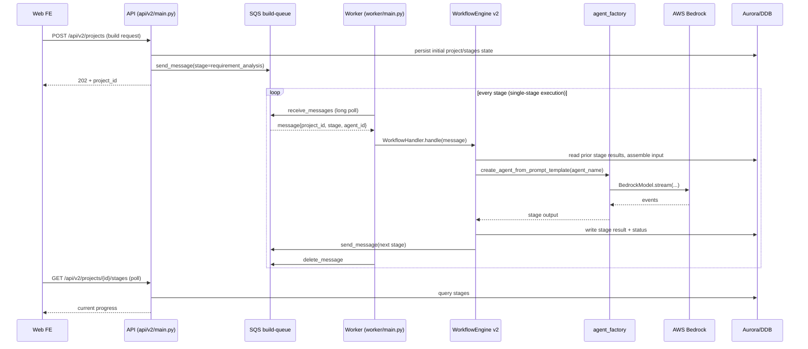

# Architecture Overview

## Overview

Nexus-AI is an open-source AI Agent development platform built on **AWS Bedrock + Strands Agents**. The platform is composed of **5 core services + 2 optional services**: API, Worker, Web, Gateway, and Bridge are core; MCP Server and Event Scheduler are opt-in. All services are managed through the `nexus-cli` script.

Two subsystems sit at the center of the platform:

1. **API (`api/v2/main.py`)**: FastAPI + Uvicorn hosting 35+ routers (auth, project/agent/session CRUD, SSE chat streaming, agent-build control, observability), exposing REST to the frontend; long-running work is dispatched to the Worker via SQS.
2. **Agent instantiation layer (`nexus_utils/agent_factory.py`, `nexus_utils/magician.py`)**: the Strands Agent construction entry point — it loads system prompts from YAML templates, creates multi-provider models (Bedrock/OpenAI/Anthropic/LiteLLM/Ollama/Gemini), attaches `@tool`-decorated functions to the Agent, and supports Graph / Swarm multi-agent orchestration.

The data layer is **three-tiered**: **Aurora PostgreSQL Serverless v2** (relational, 12 tables), **DynamoDB** (KV, 18 tables), and **ElastiCache Valkey Serverless** (cache + stream event buffer). Agent build artifacts, session files, and multimodal content live in **S3**. Asynchronous work flows through **SQS**.

## Service Topology and Communication

```
┌─────────────┐     HTTP/REST      ┌─────────────┐     SQS messages  ┌─────────────┐
│   Web FE    │ ──────────────────→ │   API BE    │ ──────────────→  │   Worker    │
│  Next.js 14 │ ←─── SSE streaming─ │  FastAPI    │                  │  async jobs │
│  :3000      │                     │  :8000      │                  │             │
└─────────────┘                     └──────┬──────┘                  └──────┬──────┘
                                           │                                │
                                           │  Python in-process            │
                                           ▼                                ▼
                                    ┌──────────────┐                ┌──────────────┐
                                    │ agent_factory│                │ agent_factory│
                                    │ Strands Agent│                │ Strands Agent│
                                    └──────┬───────┘                └──────┬───────┘
                                           │                               │
                                           ▼                               ▼
                                    ┌─────────────────────────────────────────────┐
                                    │              AWS Bedrock (Claude)            │
                                    └─────────────────────────────────────────────┘

┌─────────────┐     MCP protocol
│  MCP Server │ ←── Kiro / Claude Code / Cursor
│  FastMCP    │     (calls agent_factory directly, bypasses API)
│  :9000      │
└─────────────┘
```

### Service Inventory

| Service | Entry module | Stack | Port | Responsibility |
|---|---|---|---|---|
| API backend | `api/v2/main.py` | FastAPI + Uvicorn | 8000 | REST API, JWT auth, SSO, SSE chat streaming, data CRUD |
| Worker | `worker/main.py` | Python + SQS long polling | — | Agent build/deploy/notification workflows, single-stage execution |
| Web frontend | `web/` | Next.js 14 + React 18 + TypeScript + Tailwind | 3000 | UI, TanStack Query, i18n |
| Gateway | `nexus_utils/gateway/__main__.py` | Stream proxy + Valkey | — | Streaming proxy, WebSocket, resume on reconnect |
| Bridge | `nexus_utils/bridge/` | Python | 8001 | Remote-server connection manager (SSH-like) |
| MCP Server (optional) | `nexus_utils/mcp/mcp_server/__main__.py` | FastMCP 3.x | 9000 | Exposes agents as MCP tools to IDEs |
| Event Scheduler (optional) | `nexus_utils/event_scheduler/` | Python + cron | — | Cron-like scheduled jobs |

### Inter-service Protocols

| Link | Protocol | Notes |
|---|---|---|
| Web → API | HTTP/REST + SSE | Data queries, streaming chat |
| API → Worker | SQS | Async dispatch (build, deploy, notification) |
| Worker → Aurora/DDB | AWS SDK | Persist state and results |
| API → Gateway | HTTP/SSE | Streaming proxy (Valkey Stream buffer) |
| MCP Client → MCP Server | MCP (Streamable HTTP) | Bearer Token auth |
| MCP Server → `agent_factory` | Python in-process | Instantiates Strands Agent directly, bypasses API |

## File Layout

| Path | Responsibility | Depends on |
|---|---|---|
| `CLAUDE.md` | Claude Code working guide (conventions, commands, architecture summary) | — |
| `README.md` | Project entry point (Chinese, quick start, deploy, roadmap) | — |
| `api/v2/main.py` | FastAPI app entry — registers all routers and middlewares | `api/v2/config.py`, `api/v2/routers/*`, `api/v2/database` |
| `api/v2/config.py` | Pydantic `Settings`, DDB table-name constants, SQS queue constants | `nexus_utils/config_loader.py` |
| `api/v2/routers/` | HTTP routes (35+ router modules) | `api/v2/services/` |
| `api/v2/services/` | Business logic (28+ service classes) | `api/v2/database/` |
| `api/v2/database/` | DDB / SQS / Aurora clients, pooling + retry | `boto3` |
| `api/v2/auth/middleware.py` | Global auth middleware | JWT, SAML |
| `worker/main.py` | Worker main loop, SQS long polling, heartbeat, signal handling | `worker/handlers/workflow_handler.py`, `api/v2/database.sqs_client` |
| `worker/handlers/` | `WorkflowHandler`, `BuildHandler` | `nexus_utils/workflow/engine_v2.py` |
| `nexus_utils/agent_factory.py` | Strands Agent factory, YAML loading, multi-provider models | `strands`, `nexus_utils/prompts_manager.py`, `nexus_utils/config_loader.py` |
| `nexus_utils/magician.py` | Single-intent agent orchestrator (agent / graph / swarm) | `agent_factory`, `strands.multiagent` |
| `nexus_utils/workflow/engine_v2.py` | Workflow engine — SQS-driven single-stage exec + fork/join | `agent_factory`, Aurora DDB |
| `nexus_utils/config_loader.py` | Config loader (env > yaml > defaults) | `config/default_config.yaml`, `config/service_config.yaml` |
| `nexus_utils/observability/` | OpenTelemetry setup, metrics, FastAPI auto-instrumentation | `opentelemetry-*` |
| `nexus_utils/mcp/mcp_server/` | FastMCP server — registers agents as MCP tools | `agent_factory`, `fastmcp` |
| `nexus_utils/mcp/mcp_client/` | MCP client (agents calling external MCP servers) | — |
| `nexus_utils/gateway/` | Streaming proxy (Valkey Stream Relay) | `valkey` |
| `nexus_utils/bridge/` | Remote connection manager (multi-server, parallel, permissions) | `paramiko` / SSH |
| `nexus_utils/sandbox/` | Firecracker microVM sandbox runtime | EC2 + KVM |
| `nexus_utils/event_scheduler/` | Cron-like scheduled task runner | `apscheduler` |
| `agents/system_agents/` | Core system agents (magician, agent_build_workflow, …) | `agent_factory` |
| `agents/template_agents/` | Agent templates | — |
| `agents/generated_agents/` | Build artifacts (auto-generated) | — |
| `tools/system_tools/` | System tools (`@tool`-decorated) | `strands.tool` |
| `tools/template_tools/` | Tool templates | — |
| `tools/generated_tools/` | Generated tools (lazily synced from S3) | S3 |
| `prompts/` | YAML prompt templates (`agent.versions[].system_prompt`) | — |
| `config/default_config.yaml` | Master config (AWS, Bedrock, SQS, DDB, attachments, templates, …) | — |
| `config/service_config.yaml` | Runtime params (thread pools, timeouts, worker counts) | — |
| `config/workflows.yaml` | Workflow definitions (`agent_build` / `agent_update` / `tool_build` / `skill_build` / `magician`) | — |
| `config/mcp/system_mcp_server.json` | Pre-configured AWS MCP servers | — |
| `config/mcp/public_mcp_server.json` | User-defined MCP servers | — |
| `architecture/` | Architecture diagrams (PNG assets) | — |
| `web/` | Next.js 14 frontend | `next`, `react`, `@tanstack/query` |
| `infrastructure/` | Terraform + Docker + CloudFormation templates | — |
| `nexus-cli` | Shell entry — dispatches subcommands to `scripts/` and service manager | bash |

## Core Types / Classes

### `Settings` (`api/v2/config.py:1179`)

Extends `pydantic_settings.BaseSettings`. Config precedence: **environment variables > `config/default_config.yaml` > code defaults**. Cached via `@lru_cache`; `get_settings()` force-writes `AWS_REGION` back to the yaml value so a same-named env var cannot hijack it.

| Field (excerpt) | Type | Default | Notes |
|---|---|---|---|
| `APP_NAME` | `str` | `"Nexus-AI API"` | App name |
| `APP_VERSION` | `str` | `"0.1.0"` | Version — emitted by `/health` |
| `DEBUG` | `bool` | `False` | Debug flag |
| `AWS_REGION` | `str` | `aws.aws_region_name` | AWS region (forced to yaml value) |
| `AWS_ACCESS_KEY_ID` | `Optional[str]` | `None` | Overrides yaml `aws_access_key_id` |
| `AWS_SECRET_ACCESS_KEY` | `Optional[str]` | `None` | Same as above |
| `DYNAMODB_ENDPOINT_URL` | `Optional[str]` | `None` | For local DDB |
| `DYNAMODB_TABLE_PREFIX` | `str` | `"nexus_"` | Prefix for all table names |
| `SQS_ENDPOINT_URL` | `Optional[str]` | `None` | Custom SQS endpoint |
| `SQS_BUILD_QUEUE_NAME` | `str` | `"{prefix}build-queue"` | Build queue |
| `SQS_DEPLOY_QUEUE_NAME` | `str` | `"{prefix}deploy-queue"` | Deploy queue |
| `SQS_NOTIFICATION_QUEUE_NAME` | `str` | `"{prefix}notification-queue"` | Notification queue |
| `SQS_BUILD_DLQ_NAME` / `SQS_DEPLOY_DLQ_NAME` | `str` | `"{prefix}build-dlq"` / `"{prefix}deploy-dlq"` | Dead-letter queues |
| `BUILD_VISIBILITY_TIMEOUT` | `int` | `3600` | Build message visibility timeout (seconds) |
| `DEPLOY_VISIBILITY_TIMEOUT` | `int` | `600` | Deploy visibility timeout |
| `MESSAGE_RETENTION_DAYS` | `int` | `14` | Message retention |
| `MAX_RETRY_COUNT` | `int` | `3` | Max retries |
| `AGENTCORE_REGION` | `Optional[str]` | `aws.aws_region_name` | AgentCore deploy region |
| `AGENTCORE_DEPLOY_DRY_RUN` | `bool` | `False` | Print only, don't deploy |
| `AGENTCORE_DEFAULT_ALIAS` | `str` | `"DEFAULT"` | AgentCore alias |
| `AGENTCORE_EXECUTION_ROLE_NAME` | `Optional[str]` | `None` | Execution role ARN |
| `AGENTCORE_AUTO_CREATE_EXECUTION_ROLE` | `bool` | `True` | Auto-create IAM role |
| `AGENTCORE_AUTO_CREATE_ECR` | `bool` | `True` | Auto-create ECR repo |
| `AGENTCORE_POST_DEPLOY_TEST` | `bool` | `False` | Smoke test after deploy |
| `AGENTCORE_POST_DEPLOY_TEST_PROMPT` | `str` | `"Hello"` | Smoke-test prompt |
| `AGENTCORE_AUTO_UPDATE_ON_CONFLICT` | `bool` | `True` | Auto-update on conflict |
| `AGENTCORE_REQUIREMENTS_PATH` | `str` | `"requirements.txt"` | Dependency file |
| `AGENTCORE_IMAGE_TAG_TEMPLATE` | `str` | `"{agent_name}:{timestamp}"` | Image tag template |
| `SESSION_STORAGE_S3_BUCKET` | `Optional[str]` | `None` | Session storage bucket |
| `SESSION_STORAGE_S3_PREFIX` | `str` | `"sessions/"` | Prefix |
| `CONVERSATION_MANAGER_ENABLED` | `bool` | `True` | Conversation manager master switch |
| `CONVERSATION_MANAGER_TYPE` | `str` | `"sliding_window"` | `sliding_window` or `summarizing` |
| `CM_SLIDING_WINDOW_SIZE` | `int` | `40` | Window size |
| `CM_SLIDING_TRUNCATE_RESULTS` | `bool` | `True` | Truncate tool results |
| `CM_SUMMARY_RATIO` | `float` | `0.3` | Summary ratio |
| `CM_PRESERVE_RECENT_MESSAGES` | `int` | `10` | Recent messages to keep |
| `CM_USE_CUSTOM_AGENT` | `bool` | `True` | Use custom summarizer agent |
| `CM_CUSTOM_AGENT_MODEL_ID` | `str` | `"us.anthropic.claude-haiku-4-5-20251001-v1:0"` | Summarizer model |
| `CM_CUSTOM_AGENT_PROMPT_PATH` | `str` | `"system_agents_prompts/conversation_summarizer/conversation_summarizer"` | Summarizer prompt path |
| `ATTACHMENT_S3_BUCKET` | `str` | `"nexus-ai-attachments"` | Attachments bucket |
| `ATTACHMENT_PRESIGNED_URL_EXPIRY` | `int` | `3600` | Presigned URL TTL (s) |
| `ATTACHMENT_UPLOAD_URL_EXPIRY` | `int` | `600` | Upload URL TTL (s) |
| `ATTACHMENT_MAX_FILE_SIZE` | `int` | `50 * 1024 * 1024` | 50 MB per file |
| `ATTACHMENT_MAX_FILES_PER_MESSAGE` | `int` | `5` | Files per message |
| `TEMPLATE_S3_BUCKET` | `str` | `templates.s3_bucket` or attachments bucket | Template repo |
| `TEMPLATE_S3_KEY_PREFIX` | `str` | `"templates/"` | Prefix |
| `TEMPLATE_EFS_SUBDIR` | `str` | `"/templates"` | EFS subdir |
| `TEMPLATE_LOCAL_CACHE_DIR` | `str` | `""` | Local cache dir (no-EFS case) |
| `TEMPLATE_UPLOAD_URL_EXPIRY` | `int` | `600` | Upload URL TTL (s) |
| `TEMPLATE_MAX_FILE_SIZE` | `int` | `100 * 1024 * 1024` | 100 MB |
| `TEMPLATE_ALLOWED_EXTENSIONS` | `list` | `['pptx','docx','xlsx','pdf','html','htm','md','txt','png','jpg']` | Allowed extensions |
| `TEMPLATE_PREVIEW_TEXT_MAX_BYTES` | `int` | `100 * 1024` | Preview text cap |
| `TEMPLATE_PREVIEW_WORKERS` | `int` | `4` | Preview concurrency |
| `TEMPLATE_AI_ENABLED` | `bool` | `True` | Template-AI master switch |
| `TEMPLATE_AI_ANALYZE_MODEL` | `str` | `"us.anthropic.claude-haiku-4-5-20251001-v1:0"` | Analyze model |
| `TEMPLATE_AI_EMBED_MODEL` | `str` | `"amazon.titan-embed-text-v2:0"` | Embedding model |
| `TEMPLATE_AI_EMBED_DIM` | `int` | `1024` | Embedding dim |
| `TEMPLATE_AI_DIFF_MODEL` | `str` | `"us.anthropic.claude-haiku-4-5-20251001-v1:0"` | Diff model |
| `TEMPLATE_LIBREOFFICE_BIN` | `str` | `"libreoffice"` | Doc-conversion binary |
| `TEMPLATE_IMAGEMAGICK_BIN` | `str` | `"convert"` | Image-conversion binary |
| `TEMPLATE_TRIAL_AGENT_ID` | `str` | `"featured_deep_research"` | Trial agent id |
| `SKILL_S3_BUCKET` | `str` | `artifacts_s3_bucket` or `"nexus-ai-artifacts-2026"` | Skill storage (merged into artifacts) |
| `CORS_ORIGINS` | `list` | `["*"]` | CORS origins |
| `CORS_ALLOW_CREDENTIALS` | `bool` | `False` | CORS credentials |
| `LOG_LEVEL` | `str` | `logging.level` | Log level |

### DDB Table Constants (`api/v2/config.py:1305`)

**18 tables retained in DDB** (`api/v2/config.py:ALL_TABLES`); constants marked `[Aurora-migrated]` have been moved to Aurora and are kept only for backward compatibility.

| Constant | Default table name (with prefix) | Status |
|---|---|---|
| `TABLE_PROJECTS` | `nexus_projects` | [Aurora-migrated] |
| `TABLE_STAGES` | `nexus_stages` | [Aurora-migrated] |
| `TABLE_AGENTS` | `nexus_agents` | [Aurora-migrated] |
| `TABLE_INVOCATIONS` | `nexus_invocations` | [Aurora-migrated] |
| `TABLE_SESSIONS` | `nexus_sessions` | [Aurora-migrated] |
| `TABLE_MESSAGES` | `nexus_messages` | [Aurora-migrated] |
| `TABLE_ATTACHMENTS` | `nexus_attachments` | [Aurora-migrated] |
| `TABLE_USERS` | `nexus_users` | [Aurora-migrated] |
| `TABLE_FAVORITES` | `nexus_favorites` | [Aurora-migrated] |
| `TABLE_SKILLS` | `nexus_skills` | [Aurora-migrated] |
| `TABLE_SKILL_GROUPS` | `nexus_skill_groups` | [Aurora-migrated] |
| `TABLE_GROUPS` | `nexus_groups` | [Aurora-migrated] |
| `TABLE_TASKS` | `nexus_tasks` | DDB |
| `TABLE_TOOLS` | `nexus_tools` | DDB |
| `TABLE_CLARIFICATIONS` | `nexus_clarifications` | DDB |
| `TABLE_DYNAMIC_CONFIGS` | `nexus_dynamic_configs` | DDB |
| `TABLE_EVENT_JOBS` | `nexus_event_jobs` | DDB |
| `TABLE_EVENT_TASKS` | `nexus_event_tasks` | DDB |
| `TABLE_REMOTE_CONNECTIONS` | `nexus_remote_connections` | DDB |
| `TABLE_CONNECTORS` | `nexus_connectors` | DDB |
| `TABLE_KEYS` | `nexus_keys` | DDB |
| `TABLE_KEY_USAGE_LOGS` | `nexus_key_usage_logs` | DDB |
| `TABLE_DIRECTIVES` | `nexus_directives` | DDB |
| `TABLE_POLICIES` | `nexus_policies` | DDB |
| `TABLE_AUDIT_LOGS` | `nexus_audit_logs` | DDB |
| `TABLE_MCP_SERVERS` | `nexus_mcp_servers` | DDB |
| `TABLE_SYSTEM_CONFIGS` | `nexus_system_configs` | DDB |
| `TABLE_BACKUP_SHARES` | `nexus_backup_shares` | DDB |
| `TABLE_FILE_SHARES` | `nexus_file_shares` | DDB |
| `TABLE_BRIDGE_COMMAND_RULES` | `nexus_bridge_command_rules` | DDB |
| `TABLE_SANDBOX_INSTANCES` | `nexus_sandbox_instances` | DDB |
| `TABLE_SANDBOX_LOGS` | `nexus_sandbox_logs` | DDB |
| `TABLE_SANDBOX_NODES` | `nexus_sandbox_nodes` | DDB |
| `TABLE_SESSION_TEMPLATE_BINDINGS` | `nexus_session_template_bindings` | DDB |

> Routing is handled by `api/v2/database/dynamodb.py::_setup_aurora_proxy()`: CRUD against Aurora-migrated tables is transparently proxied to `pg_client`.

### `Worker` (`worker/main.py:1448`)

Worker main loop. Each Worker process is bound to **one** queue type (`build` or `deploy`).

| Field | Type | Notes |
|---|---|---|
| `queue_type` | `str` | `"build"` or `"deploy"` |
| `worker_id` | `str` | `worker_settings.WORKER_ID` |
| `running` | `bool` | Run flag |
| `_shutdown_event` | `threading.Event` | Shutdown signal |
| `queue_name` | `str` | Queue name selected by `queue_type` |
| `handler` | `WorkflowHandler \| None` | `build` uses `WorkflowHandler()`; `deploy` handler not yet implemented |
| `visibility_timeout` | `int` | `build` inherits `worker_settings.VISIBILITY_TIMEOUT`; `deploy` hard-coded to `600` |

Key methods:

| Method | Signature | Responsibility |
|---|---|---|
| `start` | `start(self, once: bool = False)` | Enters main loop, registers SIGINT/SIGTERM, calls `_poll_and_process()` in a loop; `once=True` exits after one poll (test mode) |
| `stop` | `stop(self)` | Sets `running=False` and `_shutdown_event.set()` |
| `_signal_handler` | `_signal_handler(self, signum, frame)` | First signal → graceful shutdown; second → `sys.exit(1)` |
| `_poll_and_process` | `_poll_and_process(self)` | `sqs_client.receive_messages` long poll; logs `[POLL] ...: None` when empty |
| `_process_message` | `_process_message(self, message: dict)` | Starts heartbeat thread, calls `self.handler.handle(message)`, deletes message on success |
| `_start_heartbeat` | `_start_heartbeat(self, receipt_handle: str) -> Optional[threading.Timer]` | Daemon thread periodically calls `change_message_visibility` to extend visibility for long jobs |

### `Magician` (`nexus_utils/magician.py:2239`)

Single-intent agent orchestrator. On construction it feeds the user input to the `magician_orchestrator` agent, which decides an `orchestration_type` (`agent` / `graph` / `swarm`), and the runtime executor is built accordingly.

| Attribute | Type | Notes |
|---|---|---|
| `_agent_cache` | `dict` (class-level) | Cache keyed by `(template_path, nocallback, custom_params)` |
| `magician_agent` | `Agent` | The orchestrator agent itself |
| `user_input` | `str` | Raw user input |
| `thinking_result` | `Any` | First-pass response from the orchestrator |
| `orchestration_result` | `AgentOrchestrationResult` | Populated after `build_magician_agent()` |

Key methods:

| Method | Signature | Responsibility |
|---|---|---|
| `build_magician_agent` | `build_magician_agent(self)` | Calls `structured_output(AgentOrchestrationResult, ...)` to produce the orchestration config, then `dynamic_build_magician_agent()` |
| `get_magician_agent` | `get_magician_agent(self, template_path, nocallback=False, custom_params=None)` | Creates (or returns from cache) an Agent; defaults: `env="production"`, `version="latest"`, `model_id="default"` |
| `dynamic_build_magician_agent` | `dynamic_build_magician_agent(self, orchestration_result)` | Dispatches by `orchestration_type` to `build_single_magician_agent` / `build_magician_graph` / `build_magician_swarm` |
| `build_single_magician_agent` | `build_single_magician_agent(self, orchestration_result)` | Parses 5 compatible shapes of agent info (`agent_info` / `selected_agent` / `agent` / `available_agents[0]` / top-level `template_path`); returns a single Agent |
| `build_magician_graph` | `build_magician_graph(self, orchestration_result)` | Builds a Graph with `strands.multiagent.GraphBuilder`; supports `graph_config` (new) and `graph_structure` (old); reads `nodes` + `edges`; when `connections` is missing, derives edges from `depends_on` |
| `build_magician_swarm` | `build_magician_swarm(self, orchestration_result)` | Builds a Swarm with `strands.multiagent.Swarm`; reads from `swarm_structure`, top-level, or `alternative_solutions[].swarm` |
| `get_magician_description` | `get_magician_description(self)` | Prints a human-readable summary of the current orchestration |
| `clear_agent_cache` / `get_cache_info` | `classmethod` | Clear / inspect the cache |

### `MODEL_PROVIDER_REGISTRY` (`nexus_utils/agent_factory.py:1801`)

Model provider registry. `create_model_for_provider()` dynamically `importlib.import_module`s the corresponding `strands.models.*` module by name.

| provider | Module path | Class | pip package |
|---|---|---|---|
| `ollama` | `strands.models.ollama` | `OllamaModel` | `strands-agents[ollama]` |
| `openai` | `strands.models.openai` | `OpenAIModel` | `strands-agents[openai]` |
| `anthropic` | `strands.models.anthropic` | `AnthropicModel` | `strands-agents[anthropic]` |
| `litellm` | `strands.models.litellm` | `LiteLLMModel` | `strands-agents[litellm]` |
| `llamaapi` | `strands.models.llamaapi` | `LlamaAPIModel` | `strands-agents[llamaapi]` |
| `mistral` | `strands.models.mistral` | `MistralModel` | `strands-agents[mistral]` |
| `gemini` | `strands.models.gemini` | `GeminiModel` | `strands-agents[gemini]` |
| `bedrock` | — (dedicated `get_bedrock_model` path) | `strands.models.BedrockModel` | built-in |

## Key Functions / Methods

### `api/v2/main.py`

| Name | Signature | Responsibility | Location |
|---|---|---|---|
| `add_request_id` | `async def add_request_id(request: Request, call_next)` | HTTP middleware: generates `request_id`, measures `process_time`, injects `X-Request-ID` / `X-Process-Time` / `X-Trace-ID` response headers, records `api.requests` and `api.errors` metrics | `api/v2/main.py:938` |
| `auth_middleware` | — | Global auth middleware (last-registered runs first); see `api/v2/auth/middleware.py` | `api/v2/main.py:986` |
| `health_check` | `GET /health` | Returns `status`, `service`, `version`, `checks.dynamodb`, `checks.sqs`; any check failure → `status=degraded` + HTTP 503 | `api/v2/main.py:1042` |
| `root` | `GET /` | Returns `{message, version, docs, health, api_prefix}` | `api/v2/main.py:1073` |
| `global_exception_handler` | `async def global_exception_handler(request, exc)` | Catches unhandled exceptions → 500 + `{success:false, error:{code:"INTERNAL_ERROR"}}` | `api/v2/main.py:1087` |
| `startup_event` | `async def startup_event()` | Reads `NEXUS_THREAD_POOL_SIZE` (default 64) and sets the asyncio default executor | `api/v2/main.py:1108` |
| `shutdown_event` | `async def shutdown_event()` | Logs shutdown | `api/v2/main.py:1126` |

### `api/v2/config.py`

| Name | Signature | Responsibility | Location |
|---|---|---|---|
| `get_settings` | `get_settings() -> Settings` (`@lru_cache`) | Returns the cached `Settings` instance, force-writing `AWS_REGION` / `AWS_DEFAULT_REGION` to the yaml `aws_region_name` so env vars can't hijack it | `api/v2/config.py:1287` |

### `worker/main.py`

| Name | Signature | Responsibility |
|---|---|---|
| `main` | `def main()` | `argparse` for `--queue build|deploy` and `--once`; creates `Worker` and calls `start()` |

### `nexus_utils/agent_factory.py`

| Name | Signature | Responsibility |
|---|---|---|
| `_fresh_boto_session` | `_fresh_boto_session()` | Prefers `nexus_utils.sandbox.vm_credentials.get_vm_boto_session()` for a credential-refreshing session; falls back to a plain `boto3.Session` |
| `_get_cache_kwargs` | `_get_cache_kwargs(resolved_model_id: str = "") -> Dict[str, Any]` | Reads `bedrock.prompt_caching`; returns `{"cache_prompt":"default","cache_tools":"default"}` only for Claude / Nova models — empty dict otherwise |
| `get_bedrock_model` | `get_bedrock_model(model_id="model_id", agent_name="template", env="production")` | Constructs a `BedrockModel`; reads `max_tokens`/`temperature`/`streaming` for this agent/env from `prompts_manager` |
| `create_model_for_provider` | `create_model_for_provider(provider, model_id, model_config=None, max_tokens=None, temperature=None)` | Dynamically loads the model class from `MODEL_PROVIDER_REGISTRY`; merges YAML `metadata.model_config` with environment parameters |
| `import_module_by_string` | `import_module_by_string(module_name)` | Safe `importlib.import_module` |
| `import_class_by_string` | `import_class_by_string(module_name, class_name)` | Safe class lookup |
| `import_from_path` | `import_from_path(full_path)` | `"pkg.sub.ClassName"` → class object |
| `get_builtin_tools_mapping` | — | Calls `tool_template_provider.get_builtin_tools()`; maps `tool_name → strands_tools.tool_name` |
| `get_system_tools_mapping` | — | Maps `tool_name → tools.&lt;path&gt;.tool_name` for system / template / generated tools |
| `_sync_tool_from_s3` | `_sync_tool_from_s3(tool_path: str) -> bool` | When `tools/generated_tools/&lt;dir&gt;/&lt;script&gt;.py` is missing, downloads it from S3 `tools/&lt;dir&gt;/&lt;script&gt;.py` and writes via `os.makedirs`; auto-creates `__init__.py` |
| `get_tool_by_path` | `get_tool_by_path(tool_path)` | Dispatches by prefix: `strands_tools/`, `system_tools/`, `template_tools/`, `generated_tools/`; `browser` tool is special-cased (`AgentCoreBrowser`) |
| `get_tool_by_name` | `get_tool_by_name(tool_name)` | Looks up by name: builtin first, then system; finally `tool_template_provider.search_tools_by_name` |
| `create_agent_from_prompt_template` | `create_agent_from_prompt_template(agent_name, env="production", version="latest", model_id="default", **kwargs)` | **Core entry point.** Loads `system_prompt`, `tools`, and `model_config` from the YAML template and returns a `strands.Agent` (Magician / Worker / MCP Server all go through this function) |

### `nexus_utils/magician.py`

| Name | Signature | Responsibility |
|---|---|---|
| `Magician.__init__` | `Magician(user_input)` | Uses `magician_orchestrator.yaml` as the Agent template; first pass `thinking_result = magician_agent(user_input)` |
| `get_magician_agent` | `get_magician_agent(template_path, nocallback=False, custom_params=None)` | Cached Agent creation; `nocallback=True` → `callback_handler=None` |
| `build_magician_agent` | `build_magician_agent()` | Produces `AgentOrchestrationResult`, then `dynamic_build_magician_agent()` |

## Call Graph / Data Flow

### Agent build (`agent_build` workflow)



The **8 build stages** (`config/workflows.yaml: agent_build`) run requirement analysis → architecture → agent design → prompting → tooling → code → testing; the agent-design stage supports **fork/join** for parallel sub-agents.

### Agent runtime chat (SSE)

```
Frontend SSE request → sessions_router (api/v2/routers/sessions.py)
  → AgentRuntimeService
  → S3SessionManager.load(session_id)        [Conversation Manager truncates]
  → agent_factory.create_agent_from_prompt_template(agent_name)
  → agent.stream(user_input)                 [Strands executes, invokes @tool]
  → event parsing → text/event-stream push
  → on completion S3SessionManager.save(session_id)
```

### MCP protocol

```
IDE MCP Client (Kiro/Claude Code/Cursor)
  → MCP Server (FastMCP, :9000)              [Bearer Token auth]
  → Enumerates agents with status=running in DDB and registers them as MCP tools
  → On tool_call, calls agent_factory.create_agent_from_prompt_template() directly
  → Bedrock inference
  → Reply to the MCP client
```

### Worker heartbeat

```
_process_message(message)
  ├─ _start_heartbeat(receipt_handle)
  │     └─ threading.Thread(daemon=True)
  │         while not heartbeat_stop.is_set() and self.running:
  │             sqs_client.change_message_visibility(queue, handle, visibility_timeout)
  │             heartbeat_stop.wait(HEARTBEAT_INTERVAL)
  ├─ handler.handle(message) → success
  ├─ success ? sqs_client.delete_message(queue, handle) : leave for SQS to redeliver
  └─ finally: heartbeat_thread.cancel()
```

## Extending

### Add a new API route

1. Create `&lt;name&gt;.py` under `api/v2/routers/`, declare `router = APIRouter(prefix="/&lt;name&gt;")` and write endpoints.
2. Create a service class under `api/v2/services/` that holds injected DB clients.
3. In `api/v2/main.py`, add:
   ```python
   from api.v2.routers.<name> import router as <name>_router
   app.include_router(<name>_router, prefix="/api/v2")
   ```
   Registration order: public → user-management → remaining v2 routes. `auth_middleware` handles auth globally; endpoints require a Bearer Token unless allow-listed in `api/v2/auth/middleware.py`.
4. If the path has path params (e.g., `/agents/{agent_id}`), metrics automatically use the templated route path to avoid high cardinality (see `api/v2/main.py:964`).

### Add a new Worker queue

1. Add `&lt;kind&gt;: nexus-&lt;kind&gt;-queue` under `sqs.queues` in `config/default_config.yaml`, then add `SQS_<KIND>_QUEUE_NAME` to `api/v2/config.py`.
2. Create `worker/handlers/&lt;kind&gt;_handler.py` with `handle(message: dict) -> bool`.
3. Patch `worker/main.py:1451` `Worker.__init__` to bind the new handler and visibility timeout under the matching `queue_type` branch.
4. Start via `./nexus-cli service start --worker` or run `python -m worker.main --queue &lt;kind&gt;` directly.

### Add a new model provider

1. Add an entry to `MODEL_PROVIDER_REGISTRY` (`nexus_utils/agent_factory.py:1801`): `"myprov": ("strands.models.myprov", "MyProvModel", "strands-agents[myprov]")`.
2. Provide provider-specific parameters (e.g., `api_key`, `base_url`) in the YAML prompt template's `metadata.model_config`.
3. `create_model_for_provider(provider=..., model_id=..., model_config=...)` will dynamically load the class — no Strands SDK changes required.

### Add a new tool

1. Define a function in `tools/system_tools/&lt;subsystem&gt;/&lt;module&gt;.py` decorated with `@tool` (`strands.tool`).
2. Prefer basic types or Pydantic models for inputs; return a string or JSON-serializable object.
3. The tool is discovered by `get_system_tools_mapping()` and exposed via `tool_template_provider.list_all_tools()`.
4. Reference it from YAML prompt templates in the `tools` list: `system_tools/&lt;subsystem&gt;/&lt;module&gt;/&lt;function_name&gt;`.
5. At runtime, if the local file is missing for generated tools, `_sync_tool_from_s3()` pulls it from `s3://{artifacts_s3_bucket}/tools/&lt;dir&gt;/&lt;script&gt;.py`.

### Add a new workflow

1. In `config/workflows.yaml`, add an entry modeled after `agent_build` / `agent_update` / `tool_build` / `skill_build`. V2 workflows support `fork/join`, `skip_stages`, and `depends_on`.
2. Each stage specifies an `agent_name` (YAML template path), `inputs` (fields from prior stages), and `outputs` (fields persisted to DDB).
3. Kick off by sending the initial SQS message with `stage` set to the first stage name.

### Constraints and pitfalls

- **Strands tool interactivity**: both `api/v2/main.py:844` and `worker/main.py:1398` set `os.environ["BYPASS_TOOL_CONSENT"]="true"` and `STRANDS_NON_INTERACTIVE="true"` before any module import. If a new process uses `@tool`-decorated `file_write` / `shell`, these **must** be set before `strands` is imported, or `prompt_toolkit` will hang waiting on stdin.
- **Observability init order**: `nexus_utils.observability.setup` must be imported before `boto3`, `FastAPI`, and `strands` (see `api/v2/main.py:848`, `worker/main.py:1416`) so auto-instrumentation takes effect.
- **Prompt caching is Claude/Nova-only**: `_get_cache_kwargs` silently skips other model families to avoid Strands SDK errors.
- **Bedrock credential refresh**: `_fresh_boto_session()` creates a new session per call. EC2 uses the IAM Role chain; sandbox VMs use `RefreshableCredentials` (see `nexus_utils.sandbox.vm_credentials`).
- **SQS long poll + visibility heartbeat**: the heartbeat thread calls `change_message_visibility` every `HEARTBEAT_INTERVAL`. If the handler blocks longer than `visibility_timeout` and the heartbeat fails, SQS redelivers the message — handlers **must** be idempotent.
- **`AWS_REGION` env-var trap**: `pydantic_settings` will override fields with a same-named env var, so `get_settings()` force-writes back to the yaml value (`api/v2/config.py:1287`).
- **Aurora transparent proxying**: using `TABLE_PROJECTS` and other `[Aurora-migrated]` constants will not actually hit DDB — calls are routed to `pg_client` by `dynamodb.py::_setup_aurora_proxy()`. New code should use the pg_client interface directly.
- **CORS is wide open by default**: `CORS_ORIGINS = ["*"]`, `CORS_ALLOW_CREDENTIALS = False`. Tighten in yaml/env for production.

## Common Debugging / Troubleshooting

| Symptom | Diagnostic keywords | Root cause |
|---|---|---|
| Agent hangs on first call | `prompt_toolkit`, stdin, `pty.fork` | `BYPASS_TOOL_CONSENT` / `STRANDS_NON_INTERACTIVE` not set |
| `/health` returns 503 | `checks.dynamodb=error:...` / `checks.sqs=error:...` | Invalid AWS credentials, wrong region, or unreachable endpoint |
| Worker idle for long periods | `[POLL] queue=... : None` | Empty queue, or `visibility_timeout` has locked the message on another worker |
| Messages processed twice | `Heartbeat failed` → redelivered | Heartbeat thread crashed or handler timed out; handler must be idempotent |
| Bedrock call denied | `AccessDeniedException`, `InvokeModel` | IAM role missing `bedrock:InvokeModel` / `InvokeModelWithResponseStream` |
| `Unsupported model provider` | `agent_factory.create_model_for_provider` | Provider declared in YAML is not in `MODEL_PROVIDER_REGISTRY` |
| `ImportError: strands-agents[...]` | `Provider 'xxx' requires 'strands-agents[xxx]'` | Missing extras; run `uv pip install 'strands-agents[xxx]'` |
| Tool file missing | `❌ Failed to import tool: generated_tools/...` | S3 sync failed; check `artifacts_s3_bucket` and IAM `s3:GetObject` |
| SSE interrupted | `GeneratorExit`, OTEL context errors | Frontend disconnect; silenced via `logging.getLogger('opentelemetry.context').setLevel(CRITICAL)` |
| `AWS_REGION` mismatch | Settings differs from yaml | Env-var hijack; `get_settings()` writes back — confirm you haven't bypassed it |
| Metric cardinality explosion | Many UUID-laden route labels | Route template not applied; see `api/v2/main.py:964` using `request.scope['route'].path` |
| Worker won't exit | Needs two Ctrl+C | First signal starts graceful shutdown; second does `sys.exit(1)` |

### Handy diagnostic commands

```bash
# Service status
./nexus-cli service status
./nexus-cli service logs --api
./nexus-cli service logs --worker -f

# Health check
curl -s http://localhost:8000/health | jq .

# SQS queue depth (needs AWS CLI)
aws sqs get-queue-attributes \
  --queue-url "$(aws sqs get-queue-url --queue-name nexus-build-queue --query 'QueueUrl' --output text)" \
  --attribute-names ApproximateNumberOfMessages ApproximateNumberOfMessagesNotVisible

# Process a single message (test mode)
python -m worker.main --queue build --once

# Call an Agent directly (bypassing API/Worker)
source .venv/bin/activate
python agents/system_agents/magician.py -i "..."
```

### Log locations

| Log | Default path | Content |
|---|---|---|
| API stdout | `logs/api.log` (redirected by `service_manager`) | Requests, middleware, `startup_event` |
| Worker stdout | `logs/worker.log` | `[POLL]`, `Processing message`, `Heartbeat` |
| `nexus_ai.log` | `config_loader` default FileHandler; removed in Worker in favor of stdout | Config loading, library-wide logs |
| OTEL / Jaeger | `http://localhost:16686` | Distributed tracing (response header `X-Trace-ID`) |

## Further Reading

- `CLAUDE.md` — Claude Code working guide and full command list
- `README.md` — Project overview, quick start, cloud deployment
- `docs/NEXUS_AI_SYSTEM_GUIDE.md` — Full installation guide
- `docs/MCP_SERVER_SETUP.md` — MCP Server deployment and IDE integration
- `docs/infrastructure/IAM_POLICIES.md` — Full IAM Policy JSON
- `config/default_config.yaml` — Master config (field meanings in `nexus_utils/config_loader.py`)
- `config/workflows.yaml` — All workflow definitions (`agent_build`/`agent_update`/`tool_build`/`skill_build`/`magician`)
- `api/v2/routers/` — 35+ router modules; index is in `api/v2/main.py:860-895`
- `nexus_utils/workflow/engine_v2.py` — Workflow engine (SQS-driven, fork/join)
- `nexus_utils/observability/` — Metrics and instrumentation
