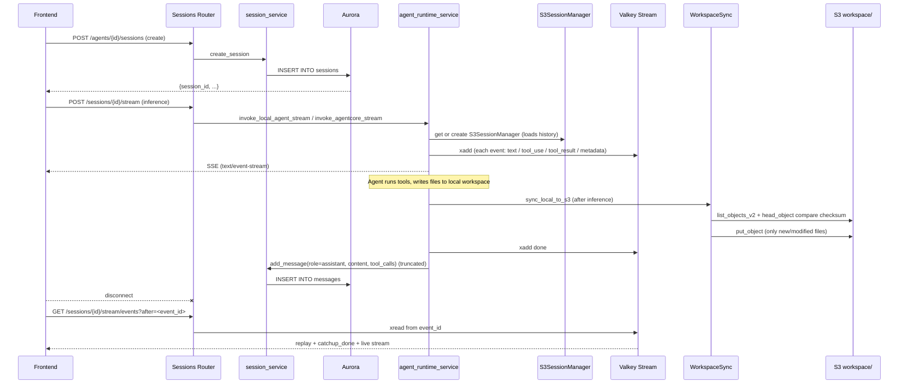

# Session Storage

## Overview

"Session storage" in Nexus-AI is the persistence subsystem that carries a single Agent conversation through its entire life cycle. It is not a single database but a cooperation of five storage media: **Aurora PostgreSQL** holds session metadata and the message stream; **Valkey Streams** buffer live SSE events; **S3** (`S3SessionManager`) persists the model-level multi-turn conversation context; a **local `.cache/`** directory backs the Agent runtime workspace; and the **S3 `workspace/` prefix** performs local ↔ cloud sync and frontend downloads.

**Boundary of responsibility:**

- **Writers**: `api/v2/routers/sessions.py` is the HTTP entry point; `api/v2/services/agent_runtime_service.py` injects the Strands SDK `S3SessionManager` into Agent instances; `nexus_utils/runtime_workspace/` builds a workspace directory for each `(agent_id, session_id)` and pushes it to S3.
- **Readers**: SSE reconnection replays from a Valkey Stream (`/sessions/{id}/stream/events`) and, once catch-up finishes, switches automatically to live; frontend file previews use S3 listing + presigned URLs; history messages come from the Aurora `messages` table.
- **What it does NOT do**: it does not store raw Bedrock response bodies; it does not store full tool input/output (large payloads are truncated before being written to DynamoDB/Aurora — the complete content lives in the workspace or the SSE event); and it does not manage attachment uploads (see `attachment_service`).

**Main entry points:**

| Entry | Location | Responsibility |
|-------|----------|----------------|
| `router` (FastAPI `APIRouter`) | `api/v2/routers/sessions.py:1557` | Registers all HTTP/SSE endpoints under `/api/v2/{…}/sessions/{…}` |
| `session_service` | imported at `api/v2/routers/sessions.py:1543` | Aurora session/message CRUD facade (`create_session`, `get_session`, `list_sessions`, `list_user_sessions_with_preview`, `list_messages`, `add_message`) |
| `_get_s3_session_manager` | `api/v2/services/agent_runtime_service.py:2156` | Constructs Strands' official `S3SessionManager` for multi-turn persistence |
| `cache_client` (Valkey singleton) | `api/v2/database/valkey.py:3411` | Streams / cache / distributed lock / Pub-Sub |
| `WorkspaceManager` | `nexus_utils/runtime_workspace/workspace_manager.py:564` | Manages the local `.cache/&lt;agent_id&gt;/&lt;session_id&gt;/` directory |
| `WorkspaceSync` | `nexus_utils/runtime_workspace/workspace_sync.py:831` | Bi-directional incremental local ↔ S3 sync, presigned URLs |
| `prepare_skill_envs` | `nexus_utils/runtime_workspace/skill_env.py:393` | Prepares Python / Node runtime environments for Skills during Agent creation |

## File Layout

| Path | Responsibility | Depends on |
|------|---------------|------------|
| `api/v2/routers/sessions.py` | 10 HTTP/SSE endpoints; SSE reconnection (Valkey Stream replay + catch-up signal); file upload base64 packaging | `fastapi`, `session_service`, `agent_service`, `attachment_service`, `chat_task_manager`, `cache_client as _valkey`, `agent_runtime_service` |
| `api/v2/services/agent_runtime_service.py` | AgentCore / local Agent streaming invocation; `S3SessionManager` cache; event parsing (`_parse_stream_event`) | `boto3`, `strands.session.s3_session_manager.S3SessionManager`, `api.v2.config.settings` |
| `api/v2/database/aurora.py` | Aurora `PostgresClient` singleton; the `sessions` / `messages` tables use the generic `_insert`/`_get`/`_update`/`_list` CRUD | `psycopg`, `psycopg_pool`, `nexus_utils.config_loader` |
| `api/v2/database/valkey.py` | `CacheClient` singleton; Streams (`xadd` / `xread` / `xrange` / `xlen`); distributed lock; Pub-Sub | `redis` (Valkey-compatible protocol) |
| `nexus_utils/runtime_workspace/__init__.py` | Module entry — exports only `WorkspaceManager` and `WorkspaceSync` | — |
| `nexus_utils/runtime_workspace/workspace_manager.py` | Local directory management, file metadata scan, read/write, path traversal protection | `hashlib`, `mimetypes`, `pathlib`, `nexus_utils.config_loader` |
| `nexus_utils/runtime_workspace/workspace_sync.py` | S3 ↔ local incremental sync; presigned URLs; online previewable/editable detection; cleanup (batched `delete_objects`) | `boto3`, `botocore.config.Config`, `WorkspaceManager` |
| `nexus_utils/runtime_workspace/workspace_tools.py` | Three `@strands.tool`-decorated Agent tools: `runtime_workspace_list_files`, `runtime_workspace_read_file`, `runtime_workspace_write_file` | `strands` |
| `nexus_utils/runtime_workspace/skill_env.py` | Skill dependency cache; `setup_python_env` / `setup_node_env` / `prepare_skill_envs` | `subprocess`, `hashlib`, `nexus_utils.skill.storage`, `api.v2.database.db_client` |

## The Five-Way Storage Overview

A single session's data lives in 5 places simultaneously. The relationship:

```
                        ┌────────────────────────────────┐
                        │  HTTP / SSE (FastAPI router)   │
                        │  api/v2/routers/sessions.py    │
                        └────────────┬───────────────────┘
                                     │
        ┌────────────────────┬───────┴────────┬───────────────────┐
        ▼                    ▼                ▼                   ▼
 ┌──────────────┐   ┌──────────────────┐  ┌─────────────┐  ┌──────────────┐
 │ Aurora PG    │   │ Valkey Streams   │  │  S3 (Strands│  │ local .cache/│
 │ sessions/    │   │ nexus:chat:stream│  │ S3SessionMgr│  │ <agent>/<ses>│
 │ messages     │   │ :<session_id>    │  │ multi-turn  │  │   workspace  │
 │ (meta + msgs)│   │ (SSE replay buf) │  │ LLM context │  │    files     │
 └──────────────┘   └──────────────────┘  └─────────────┘  └──────┬───────┘
                                                                    │ incr.
                                                                    ▼
                                                           ┌────────────────┐
                                                           │ S3 workspace/  │
                                                           │ <agent>/<ses>/ │
                                                           │ (remote mirror)│
                                                           └────────────────┘
```

| Medium | Key / path | TTL | Writer | Reader |
|--------|------------|-----|--------|--------|
| Aurora `sessions` table | `session_id` primary key | permanent | `session_service.create_session` / `update_session` | `GET /sessions/{id}`, `list_agent_sessions`, `list_my_sessions` |
| Aurora `messages` table | `(session_id, message_id)` | permanent | `session_service.add_message` | `GET /sessions/{id}/messages` |
| Valkey Stream | produced by `chat_task_manager.get_stream_key(session_id)` | typically 30 min (`expire_stream(..., ttl=1800)`) | live Agent inference | `/sessions/{id}/stream/events` (SSE reconnect) |
| Valkey lock | maintained by `chat_task_manager` | 10 min (`ttl=600`) | `acquire_lock` at inference start | duplicate-request detection |
| S3 `SESSION_STORAGE_S3_BUCKET/SESSION_STORAGE_S3_PREFIX/&lt;session_id&gt;/...` | defined internally by Strands SDK | permanent | `S3SessionManager` (called from inside Strands Agent) | auto-loaded on next turn |
| Local `.cache/&lt;agent_id&gt;/&lt;session_id&gt;/` | project root | process lifetime (manual `cleanup` or `WorkspaceSync.cleanup`) | Agent runtime tools (file_write, shell, …) | `WorkspaceManager.scan_files` / tool reads |
| S3 `workspace/&lt;agent_id&gt;/&lt;session_id&gt;/` | `attachment_s3_bucket` (default `nexus-ai-attachments-2026`) | permanent (batched `delete_objects` on session cleanup) | `WorkspaceSync.sync_local_to_s3` | frontend list + presigned download |

## Session Metadata & Messages (Aurora)

Aurora's two tables go through `PostgresClient`'s generic CRUD. `aurora.py` itself does not expose business methods like `create_session` / `add_message` (those belong to `session_service`), but the 5 primitives used underneath are:

| Method | Location | Signature | Purpose |
|--------|----------|-----------|---------|
| `_insert` | `aurora.py:2777` | `_insert(table, data) -> dict` | `INSERT … RETURNING *`, auto-filters unknown columns |
| `_get` | `aurora.py:2785` | `_get(table, where, params) -> Optional[dict]` | `SELECT * … WHERE … LIMIT 1` |
| `_update` | `aurora.py:2789` | `_update(table, where, where_params, updates) -> Optional[dict]` | auto-injects `updated_at`; `UPDATE … RETURNING *` |
| `_delete` | `aurora.py:2799` | `_delete(table, where, params) -> bool` | `DELETE FROM … WHERE …` |
| `_list` | `aurora.py:2804` | `_list(table, where, params, order_by, limit, offset) -> list` | `SELECT * [WHERE] [ORDER] [LIMIT] [OFFSET]` |

### `_filter_data` and the column cache

Every write first calls `_filter_data(table, data)` (`aurora.py:2762`), which only retains columns that exist in `information_schema.columns`. Results are cached in `_column_cache`, a class-level `Dict[str, set]`. This means: **adding a nested key inside a JSONB field such as `sessions.metadata` needs no migration, but adding a new top-level column requires a DDL migration plus a process restart to invalidate the cache**.

### JSONB wrapping

```python
# aurora.py:2733
@staticmethod
def _jsonb(v):
    if isinstance(v, (dict, list)):
        return Jsonb(v)
    return v
```

Dicts/lists are auto-wrapped as `psycopg.types.json.Jsonb` — callers do not need to care about the conversion between PostgreSQL JSONB and Python dict. The `metadata` field (hiding `files`, `files_count`, `real_agent_id`, …) relies on this transparent layer.

### Connection pool parameters

| Parameter | Source | Default |
|-----------|--------|---------|
| `host` | `NEXUS_AURORA_HOST` env / `config.get('aurora.host')` | required |
| `port` | `aurora.port` | `5432` |
| `dbname` | `aurora.database` | `nexus` |
| `user` | `aurora.username` | `nexus_admin` |
| `password` | `NEXUS_AURORA_PASSWORD` / `aurora.password` | required |
| `sslmode` | `require` if `aurora.ssl` truthy, else `prefer` | `require` |
| `min_size` | `aurora.min_connections` | `2` |
| `max_size` | `aurora.max_connections` | `20` |
| `autocommit` | fixed | `True` |
| `row_factory` | fixed | `dict_row` |

All SQL runs inside a `self.pool.connection()` context manager and returns `dict` rows; `_row_to_dict` converts `datetime` / `date` / `Decimal` to ISO strings and int/float respectively.

## Sessions Router — 10 Endpoints

All routes mount under `prefix="/api/v2"` (wired by `api/v2/main.py`). Every endpoint has `dependencies=[Depends(require_permission(...))]` for auth; `user_id` always comes from JWT's `current_user["user_id"]` — never from the client.

| # | Method | Path | Handler | Permission | Location |
|---|--------|------|---------|------------|----------|
| 1 | POST | `/agents/{agent_id}/sessions` | `create_session` | `session:create` | `sessions.py:1616` |
| 2 | GET | `/me/sessions` | `list_my_sessions` | `session:list` | `sessions.py:1662` |
| 3 | GET | `/agents/{agent_id}/sessions` | `list_agent_sessions` | `session:list` | `sessions.py:1696` |
| 4 | GET | `/sessions/{session_id}` | `get_session` | `session:read` | `sessions.py:1738` |
| 5 | GET | `/sessions/{session_id}/messages` | `list_messages` | `session:read` | `sessions.py:1765` |
| 6 | GET | `/sessions/{session_id}/stream/events` | `stream_events` | `agent:chat` | `sessions.py:1798` |
| 7 | GET | `/sessions/{session_id}/stream/status` | `get_stream_status` | `agent:chat` | `sessions.py:1828` |
| 8 | POST | `/sessions/{session_id}/messages` | `send_message` | `agent:chat` | `sessions.py:1913` |
| 9 | POST | `/sessions/{session_id}/upload` | `upload_files_to_session` | `agent:chat` | `sessions.py:1956` |
| 10 | POST | `/sessions/{session_id}/stream` | `stream_chat` | `agent:chat` | `sessions.py:2016` |

### Endpoint 1 — `create_session`

```python
@router.post("/agents/{agent_id}/sessions", response_model=SessionDetailResponse,
             dependencies=[Depends(require_permission("session:create"))])
async def create_session(
    agent_id: str = Path(..., description="Agent ID"),
    request: CreateSessionRequest = None,
    current_user: dict = Depends(get_auth_user),
):
```

- **Favorite Agent handling**: when `agent_id.startswith('fav-')`, the real Agent ID is pulled from `request.metadata.real_agent_id`; missing → 400.
- Calls `session_service.create_session(agent_id=..., user_id=..., display_name=..., metadata=...)`.
- `user_id` always comes from JWT; request-supplied values are **ignored**.

### Endpoint 2 — `list_my_sessions`

Lists the current user's N most recent sessions across all Agents (`limit: 1–100`, default 50). Calls `session_service.list_user_sessions_with_preview(user_id, limit)`. The source comment makes the performance contract explicit: **"single SQL with window-function aggregation, avoiding N+1"**.

### Endpoint 3 — `list_agent_sessions`

- Skips Agent-existence validation when `agent_id` starts with `fav-` (favorites remain visible even if the underlying Agent is hidden).
- `is_admin = current_user.get("role") == "admin"` — admins see all; regular users are filtered by `s.user_id == current_user.user_id`.

### Endpoints 4 / 5 — Read-only detail

`get_session` and `list_messages` are thin pass-throughs to `session_service.get_session` / `session_service.list_messages(session_id, limit=1000, ..., le=5000)`; return 404 when the session is missing.

### Endpoint 6 — `stream_events` (SSE reconnect core)

```python
@router.get("/sessions/{session_id}/stream/events",
            dependencies=[Depends(require_permission("agent:chat"))])
async def stream_events(
    session_id: str = Path(..., description="Session ID"),
    after: str = Query('0', description="Read events after this event_id (used for reconnect)"),
):
```

Flow:

1. `stream_key = chat_task_manager.get_stream_key(session_id)`, `status = chat_task_manager.get_status(session_id)`.
2. If `stream_key` is falsy and `status != 'running'` → 410 (`"Stream expired or missing, load from message history"`), prompting the frontend to fall back to `/messages`.
3. Otherwise return `StreamingResponse(_read_valkey_stream(stream_key, last_id=after), media_type="text/event-stream")` with `Cache-Control: no-cache` and `X-Accel-Buffering: no` (disables Nginx buffering).

`_read_valkey_stream` (`sessions.py:1844`) is the heart of the reconnect semantics. The `catchup_done` signal is critical for the frontend to render history in one shot before switching to live streaming:

- Heartbeat period: `NEXUS_SSE_HEARTBEAT_INTERVAL` (default 15 s).
- Batch size: `_batch_size = 50` (at most 50 events per `xread`).
- `catchup_signaled` fires only once, with two triggers:
  1. `xread` returns empty first (block timeout with no data ⇒ catch-up done).
  2. `xread` returns fewer than `batch_size` entries (this batch is the tail).
- On empty reads, `heartbeat` is also yielded; if `xlen(stream_key) == 0`, `done` is yielded and the generator returns.
- Event shape: `{event, data, _event_id}`. `_event_id` is injected from Valkey's `event_id` and the frontend resumes using it via `after=`.

### Endpoint 7 — `get_stream_status`

A simple query:

```json
{
  "success": true,
  "data": {
    "session_id": "...",
    "status": "running|done|error|null",
    "stream_key": "nexus:chat:stream:<session_id> | null",
    "has_active_stream": true|false
  }
}
```

### Endpoint 8 — `send_message` (persist only, no inference)

```python
message = session_service.add_message(
    session_id=session_id,
    role=request.role,
    content=request.content,
    metadata=metadata,   # auto-injects files_count / files summary (no base64 data)
)
```

File summary fields: `[{'filename', 'content_type', 'size'}, ...]` (three fields each; real base64 travels via `upload_files_to_session` or the inline `send_message.files` payload).

### Endpoint 9 — `upload_files_to_session`

For each `UploadFile`: read all bytes → `base64.b64encode` → return `FileUploadResponse(files=[{filename, content_type, size, data, file_id}], count, session_id)`. On failure the endpoint raises 500 and **the whole batch rolls back** (the exception aborts the loop before the next file is processed).

**Note**: the returned base64 data must be handed back by the frontend as `request.files` to `/sessions/{id}/stream`; this endpoint does **not** write the file to the workspace or S3 — it is a handshake-and-return-base64 channel only (large files will blow past DynamoDB message-record limits, so prefer the `attachment_ids` presigned-upload flow described next).

### Endpoint 10 — `stream_chat` (actual inference entry)

End-to-end flow (key branches):

1. Load `session = session_service.get_session(session_id)` → 404 if None.
2. Resolve `real_agent_id` from `session.agent_id`; `fav-` prefix pulls `session.metadata.real_agent_id`.
3. `agent_service.get_agent(real_agent_id)` → 404 if None.
4. **Runtime-type resolution** (before attachment handling, decides the attachment transport): `sandbox_service.scheduler.resolve_runtime(agent_record, user_preference=getattr(request, "runtime_type", None))`, takes `.value`, falls back to `"local"`.
5. **Attachment handling** (`request.attachment_ids` branch, taking precedence over inline `files`):
   - **Sandbox mode** (`ec2` / `agentcore`): only download to EFS via `attachment_service.download_attachments_to_workspace(...)`, no base64; `files_data` carries only `filename / content_type / file_size` to avoid a double S3 fetch.
   - EFS mount path is built from `nexus_utils.sandbox.config.efs_data_mount()` + `workspace_prefix()` + `session_id`.
6. Then dispatches to either `invoke_agentcore_stream` or `invoke_local_agent_stream` (both async generators imported from `agent_runtime_service`).
7. SSE uses `_truncate_for_sse(text, max_length)` for throttling: `SSE_TOOL_INPUT_MAX_LENGTH = 100`, `SSE_TOOL_RESULT_MAX_LENGTH = 2000`; persistence uses the tighter `_truncate_tool_calls` (`TOOL_INPUT_MAX_LENGTH = 200`, `TOOL_RESULT_MAX_LENGTH = 500`) to keep a row under DynamoDB's size limit.

The truncation helper:

```python
# sessions.py:1569
def _truncate_for_sse(text: str, max_length: int) -> str:
    if not text or len(text) <= max_length:
        return text
    return text[:max_length] + f"... [truncated, {len(text)} chars total]"
```

## Agent Runtime — `S3SessionManager` (Strands multi-turn context)

Strands ships `S3SessionManager` officially, and it is constructed by `_get_s3_session_manager(session_id)` in `api/v2/services/agent_runtime_service.py:2156`:

```python
from strands.session.s3_session_manager import S3SessionManager

session_manager = S3SessionManager(
    session_id=session_id,
    bucket=settings.SESSION_STORAGE_S3_BUCKET,
    prefix=settings.SESSION_STORAGE_S3_PREFIX,
    region_name=settings.AWS_REGION,
)
```

### Required configuration

| Setting | Variable | Behavior |
|---------|----------|----------|
| S3 bucket | `settings.SESSION_STORAGE_S3_BUCKET` | If unset the function returns `None` and logs `logger.warning("... multi-turn conversation disabled")` — the Agent keeps working but **is stateless across turns**. |
| S3 prefix | `settings.SESSION_STORAGE_S3_PREFIX` | All session objects hang under `{prefix}/{session_id}/...`. |
| Region | `settings.AWS_REGION` | Same region as the S3 bucket to avoid cross-region charges. |

### Cache strategy

```python
# agent_runtime_service.py:2147
_cache_lock = threading.Lock()
_session_manager_cache: Dict[str, Any] = {}

cache_key = f"{settings.SESSION_STORAGE_S3_BUCKET}:{session_id}"
with _cache_lock:
    if cache_key in _session_manager_cache:
        return _session_manager_cache[cache_key]
```

Cache granularity = `bucket:session_id`. **It does not invalidate on Agent switch** — the same `session_id` reuses the same `S3SessionManager` for the lifetime of the process.

### Relationship with the Agent instance cache

The same module also maintains `_agent_instance_cache` (`agent_runtime_service.py:2153`), keyed by **`session_id + prompt_path`** — i.e. changing the system prompt creates a new instance, but repeated calls with the same prompt reuse one `strands.Agent` object and therefore the same `S3SessionManager`.

### Concurrency-control constants

| Constant | Source | Default | Meaning |
|----------|--------|---------|---------|
| `AGENT_CREATION_TIMEOUT` | `NEXUS_AGENT_CREATION_TIMEOUT` | `120` s | Agent factory construction timeout |
| `AGENT_STREAM_TIMEOUT` | `NEXUS_AGENT_STREAM_TIMEOUT` | `300` s | Single streaming inference timeout, prevents a stuck Bedrock call from holding the stream open |
| `AGENT_MAX_CONCURRENCY` | `NEXUS_AGENT_MAX_CONCURRENCY` | `5` | Local Agent concurrency cap (`asyncio.Semaphore`) to avoid Bedrock throttling |

## Valkey Streams — Live Event Buffer

`CacheClient` (`valkey.py:3112`) is the thread-safe singleton for Valkey Serverless; the global instance is `cache_client` (`valkey.py:3411`). This subsystem only cares about Stream / Lock / Pub-Sub.

### Two Redis clients

| Field | Purpose | `socket_timeout` |
|-------|---------|------------------|
| `_client` | Regular KV / non-blocking stream ops | 5 s |
| `_stream_client` | Dedicated connection for blocking `XREAD(block=N)` | 60 s — **must exceed the longest `block_ms` (30 s) plus margin**, otherwise every block timeout raises `TimeoutError` |

```python
# valkey.py:3168
self._stream_client = redis.Redis(
    host=endpoint,
    ...
    socket_timeout=60,
    retry_on_timeout=True,
)
```

### Stream API

| Method | Signature | Notes |
|--------|-----------|-------|
| `xadd` | `xadd(stream_key, fields: dict, maxlen: int = 2000) -> Optional[str]` | Non-string fields auto-encode via `json.dumps(cls=_CacheEncoder)`; `maxlen=2000` is a ring-buffer cap (keeps the newest 2000 events) |
| `xread` | `xread(stream_key, last_id: str = '0', block_ms: int = 15000, count: int = 50) -> list` | Uses `stream_client`; returns `[(event_id, {field: value}), ...]` |
| `xrange` | `xrange(stream_key, start: str = '-', end: str = '+', count: int = 100) -> list` | Non-blocking range scan |
| `xlen` | `xlen(stream_key) -> int` | Length; returns 0 on failure (**does not** raise) |
| `expire_stream` | `expire_stream(stream_key, ttl: int = 1800)` | Sets TTL explicitly (Streams are not cleaned by Redis's default EXPIRE) |

### Distributed lock

```python
# valkey.py:3366
def acquire_lock(self, key: str, value: str = '1', ttl: int = 600) -> bool:
    ...
    return bool(self.client.set(key, value, nx=True, ex=ttl))

def release_lock(self, key: str):
    self.delete(key)

def get_lock_value(self, key: str) -> Optional[str]:
    ...
```

**Trap**: `acquire_lock` returns `True` when Valkey is unavailable (**so as not to block business traffic**). That means every node can acquire the lock in a Valkey outage — make sure Valkey is always reachable in production.

### Pub/Sub

`publish(channel, message)` auto-`json.dumps` non-string messages; returns the subscriber count. This subsystem uses it for **background Agent completion notifications** — a worker finishing inference publishes to a channel such as `chat:done:&lt;session_id&gt;`, and the SSE loop or a poll observer picks up the `done` event.

### Cache-invalidation helpers

| Method | Invalidated keys |
|--------|------------------|
| `invalidate_project(project_id)` | `project:dashboard:&lt;id&gt;`, `project:detail:&lt;id&gt;`, `stats:overview`, `stats:build:*`, `projects:list:*` |
| `invalidate_agent(agent_id)` | `agent:detail:&lt;id&gt;`, `stats:overview`, `agents:list:*`, `stats:agents:*` |
| `invalidate_stage(project_id)` | `project:dashboard:&lt;id&gt;` |
| `invalidate_tool(project_id)` | `tools:project:&lt;id&gt;` (if id given) + `tools:*` |
| `invalidate_skill()` | `skills:*` |
| `invalidate_user(user_id)` | `user:auth:&lt;id&gt;` |
| `invalidate_stats()` | `stats:overview` + `stats:*` |

## Runtime Workspace — `nexus_utils/runtime_workspace/`

### Design constraints

- **Local root**: project root `/ .cache/&lt;agent_id&gt;/&lt;session_id&gt;/` (overridable via `runtime_workspace.local_base_dir`).
- **S3 root**: `{s3_prefix}/{agent_id}/{session_id}/`, where `s3_prefix` defaults to `workspace/` (config `runtime_workspace.s3_prefix`).
- **Excluded directory**: `nexus_ai_internal_attachments_temp/` — attachments are managed by `attachment_service` and are not part of workspace scan/sync/list.

### `WorkspaceManager` — local directory

Constructor parameters (`workspace_manager.py:572`):

| Parameter | Type | Default | Description |
|-----------|------|---------|-------------|
| `agent_id` | `str` | required | Agent ID |
| `session_id` | `str` | required | Session ID |
| `config` | `Optional[Dict[str, Any]]` | `_get_config()` | reads `nexus_ai_config.runtime_workspace` |
| `workspace_path` | `Optional[str]` | `None` | Explicit path; when omitted defaults to `.cache/&lt;agent&gt;/&lt;session&gt;/` |

Methods:

| Method | Signature | Behavior |
|--------|-----------|----------|
| `ensure_workspace` | `() -> Path` | `mkdir(parents=True, exist_ok=True)` |
| `get_workspace_path` | `() -> str` | `str(self.workspace_path)` |
| `exists` | `() -> bool` | `workspace_path.exists()` |
| `scan_files` | `() -> List[Dict[str, Any]]` | `rglob('*')` collecting `path / size / content_type / checksum / modified_at`, skipping `nexus_ai_internal_attachments_temp/` |
| `read_file` | `(relative_path) -> Optional[bytes]` | Path-traversal check (`resolve().relative_to`) → `read_bytes()` |
| `write_file` | `(relative_path, content: bytes) -> bool` | Same check + auto parent-dir creation + `write_bytes` |
| `delete_file` | `(relative_path) -> bool` | Same check + `unlink()` |
| `cleanup` | `() -> bool` | `shutil.rmtree(workspace_path)` |
| `get_workspace_size` | `() -> int` | `sum(stat.st_size)` |
| `_calculate_checksum` | `(file_path: Path) -> str` | 8 KB-chunk SHA256; returns `""` on exception |

**MIME augmentation**: on module import the code registers `text/markdown(.md)`, `text/yaml(.yaml/.yml)`, `text/x-python(.py)`, `text/typescript(.ts)`, `text/javascript(.js)`.

**Path traversal protection** example (`workspace_manager.py:677`):

```python
try:
    file_path.resolve().relative_to(self.workspace_path.resolve())
except ValueError:
    logger.warning(f"Path traversal attempt: {relative_path}")
    return None
```

### `WorkspaceSync` — bi-directional local ↔ S3 sync

Constructor parameters mirror `WorkspaceManager`; it owns an internal `WorkspaceManager` instance (`workspace_sync.py:858`).

S3 configuration (lazy-init):

| Field | Source | Default |
|-------|--------|---------|
| `_bucket` | `nexus_config.attachment_s3_bucket` | `"nexus-ai-attachments-2026"` |
| `_s3_prefix` | `config.s3_prefix` | `"workspace/"` |
| `_presigned_url_expiry` | `config.presigned_url_expiry` | `3600` s |
| `_inline_max_size` | `config.inline_content_max_size` | `1048576` bytes (1 MB) |
| `region` | `aws_config.aws_region_name` | `"us-west-2"` |
| `signature_version` | fixed | `s3v4` |
| `addressing_style` | fixed | `virtual` |
| `retries` | fixed | `max_attempts=3, mode='adaptive'` |

**S3 key construction**:

```python
# workspace_sync.py:913
def _s3_key(self, relative_path: str) -> str:
    prefix = self._s3_prefix.rstrip('/')
    return f"{prefix}/{self.agent_id}/{self.session_id}/{relative_path}"
```

#### Core methods

| Method | Signature | Behavior |
|--------|-----------|----------|
| `sync_local_to_s3` | `() -> Dict[str, Any]` | Incremental upload based on checksum comparison; returns `{uploaded, skipped, failed, total}` |
| `_get_s3_checksums` | `() -> Dict[str, str]` | `list_objects_v2` + per-key `head_object` to pull `Metadata.checksum` |
| `sync_s3_file_to_local` | `(relative_path) -> bool` | Writes a single S3 file back to local (used after frontend save) |
| `list_files` | `() -> List[Dict[str, Any]]` | Lists from S3, attaching presigned download URL / previewable / editable flags |
| `get_file_content` | `(relative_path) -> Optional[Tuple[bytes, str]]` | Reads content + content_type from S3 |
| `save_file_content` | `(relative_path, content: bytes, content_type: Optional[str] = None) -> bool` | Writes to S3 and, when `config.sync_on_edit == True` (default), to local too |
| `generate_upload_url` | `(relative_path, content_type: str) -> Optional[str]` | Presigned PUT URL for direct-to-S3 frontend upload |
| `_generate_presigned_url` | `(s3_key, method, extra_params=None) -> Optional[str]` | Unified presign (method = `get_object` / `put_object`) |
| `cleanup` | `() -> Dict[str, Any]` | Local `rmtree` + batched `delete_objects` (1000 per batch) |

#### Chinese filenames and Content-Disposition

Every object returned by `list_files` carries a presigned URL with `ResponseContentDisposition` forcing download. Non-ASCII filenames must use RFC 5987 encoding or S3 will return 400:

```python
# workspace_sync.py:1096
filename = rel_path.rsplit('/', 1)[-1] if '/' in rel_path else rel_path
try:
    filename.encode('iso-8859-1')
    disposition = f'attachment; filename="{filename}"'
except UnicodeEncodeError:
    from urllib.parse import quote
    disposition = f"attachment; filename*=UTF-8''{quote(filename)}"
```

#### Previewable / editable detection

`_is_previewable(content_type, filename='')` (`workspace_sync.py:1289`):

- `text/*` → previewable
- `image/*` → previewable
- `application/json` / `application/xml` → previewable
- `text/html` → previewable
- `application/pdf` → previewable
- Extension allowlist: `{md, json, yaml, yml, xml, csv, log, py, js, ts, jsx, tsx, html, css, sql, sh, bash, txt, cfg, ini, toml, png, jpg, jpeg, gif, webp, svg, bmp, pdf}`

`_is_editable(content_type)` (`workspace_sync.py:1327`):

- `text/*` → editable
- `application/json`, `application/xml`, `application/javascript` → editable
- Everything else → read-only

#### Incremental sync algorithm

```text
sync_local_to_s3():
    local_files = manager.scan_files()         # each file carries SHA256 checksum
    s3_checksums = _get_s3_checksums()          # S3 object Metadata.checksum

    for file in local_files:
        if s3_checksums[file.path] == file.checksum:
            skipped += 1
        else:
            put_object(Bucket, Key=_s3_key(file), Body=content,
                       ContentType=..., Metadata={'checksum': file.checksum})
            uploaded += 1
```

**Note**: `_get_s3_checksums` issues an extra `head_object` per object — that is O(N) for workspaces with thousands of files; a future optimization is to move the checksum into ListObjectsV2 `Tagging` or cache it in Valkey.

## Agent Tools — `nexus_utils/runtime_workspace/workspace_tools.py`

Three `@strands.tool`-decorated functions are auto-registered as Agent tools (when `WorkspaceManager` is active):

| Tool | Signature | Returns |
|------|-----------|---------|
| `runtime_workspace_list_files` | `(workspace_path: str, prefix: str = "") -> str` | JSON `{workspace, file_count, files: [{path, size_bytes, last_modified}]}` |
| `runtime_workspace_read_file` | `(workspace_path: str, file_path: str, max_bytes: int = 100000) -> str` | File content (UTF-8, `errors='replace'`); when above `max_bytes`, appends `... [truncated: ...]` |
| `runtime_workspace_write_file` | `(workspace_path: str, file_path: str, content: str, encoding: str = "utf-8") -> str` | JSON `{status, message, size_bytes}` or `{status: 'error', message}` |

**Unified path-traversal guard** (`_safe_resolve`, `workspace_tools.py:1369`):

```python
abs_path = os.path.normpath(os.path.join(workspace_path, relative_path))
if not abs_path.startswith(os.path.normpath(workspace_path)):
    return ''
return abs_path
```

**Note**: the tool takes `workspace_path` explicitly; the Agent must read the path from the system prompt's "Runtime Workspace" block, otherwise the tool returns `Error: workspace_path is required`.

## Skill Runtime Environment — `skill_env.py`

Prepares dependencies for each linked Skill at Agent-creation time; the Agent itself is unaware.

### Public entry

```python
# skill_env.py:393
def prepare_skill_envs(
    skill_ids: List[str],
    workspace_path: Optional[str] = None,
) -> Dict[str, Any]:
    """
    Returns {
        'skills': {skill_id: {skill_path, python_bin, node_path, ...}},
        'prompt_snippet': str,
    }
    """
```

Flow (per Skill):

1. `skill_storage.ensure_local(sid, skill_type, skill_name)` — download/update Skill files locally.
2. `setup_python_env(skill_dir)` — if `requirements.txt`/`scripts/requirements.txt` exists or SKILL.md contains `pip install ...`, create `.venv` and install; otherwise returns `None`.
3. `setup_node_env(skill_dir)` — if `package.json` exists or SKILL.md contains `npm install ...`, run `npm install --prefix &lt;skill_dir&gt;`.
4. Writes install paths into `info['python_bin']` / `info['node_path']` and into the prompt snippet.

### Dependency-cache mechanism

| File | Location | Content |
|------|----------|---------|
| `.python_deps_hash` | `&lt;skill_dir&gt;/` | SHA256 of `requirements.txt` (or the joined package list extracted from SKILL.md) |
| `.node_deps_hash` | `&lt;skill_dir&gt;/` | SHA256 of `package.json` (or extracted npm package list) |

Reads compare via `_is_deps_cached(skill_dir, hash_file, current_hash)`; a match skips the install step entirely.

### Python venv creation (uv first, stdlib `venv` fallback)

```python
# skill_env.py:264
def _create_venv(venv_dir: Path, python_bin: Path) -> bool:
    try:
        proc = subprocess.run(
            ["uv", "venv", str(venv_dir), "--python", "python3"],
            capture_output=True, text=True, timeout=30,
        )
        if proc.returncode == 0:
            return True
    except (FileNotFoundError, subprocess.TimeoutExpired):
        pass
    # fall back to stdlib venv
    import venv as _venv_mod
    _venv_mod.create(str(venv_dir), with_pip=True)
```

Likewise `_pip_install` tries `uv pip install` first, then falls back to `&lt;python_bin&gt; -m pip install`; both use a 300 s timeout.

### SKILL.md extraction rules

| Language | Regex (from source) |
|----------|---------------------|
| npm | `r'npm\s+install\s+(?:-g\s+)?([a-zA-Z0-9@/_-]+(?:\s+[a-zA-Z0-9@/_-]+)*)'` |
| pip | `r'pip\s+install\s+(?:-[A-Za-z]+\s+)*([a-zA-Z0-9_-]+(?:\s+[a-zA-Z0-9_-]+)*)'` |

Extracted package names are deduped + sorted. If a Skill has no `package.json` but declares npm installs, `setup_node_env` synthesizes a minimal `package.json`:

```json
{
  "name": "skill-<skill_dir.name>-deps",
  "version": "1.0.0",
  "private": true,
  "dependencies": {"<pkg>": "latest"}
}
```

### Prompt-snippet format

When at least one Skill returns environment info, `prepare_skill_envs` assembles a block that is injected into the Agent system prompt:

```text
## Skill Runtime Environments
The following Skills have their dependencies pre-installed in their own directories.
Use the absolute paths below when running Skill scripts.
Your file operations (file_write, shell, etc.) work in your workspace as usual.
**Important**: Do NOT run `npm install` or `pip install` yourself — dependencies are ready.

- **<skill_name>** (id: `<sid>`):
  Skill path: `<skill_dir>`
  Python scripts: `<python_bin> <skill_dir>/scripts/SCRIPT.py [args]`
  Node.js: When running JS files that require Skill packages, prefix with `NODE_PATH=<node_modules>`
  Example: `NODE_PATH=<node_modules> node your_script.js`
```

## Data Flow: One Full Conversation



## Extending

### Add another session-level storage medium

1. Create a new facade under `api/v2/services/` (e.g. `audit_service.py`) and mirror the function signatures from `session_service`.
2. Need a connection pool → reuse `api.v2.database.aurora.pg_client`; need KV → reuse `api.v2.database.valkey.cache_client`.
3. Import it at the top of `api/v2/routers/sessions.py` and call it from the appropriate endpoint (do not drop raw boto3 calls into the router).

### Add a new SSE event type

1. Producer side: in the streaming `yield` path of `agent_runtime_service`, add `{"event": "&lt;new_type&gt;", ...}` and call `cache_client.xadd(stream_key, {"type": "&lt;new_type&gt;", "data": json.dumps(...)})`.
2. Consumer side: `_read_valkey_stream` injects `_event_id` into every event; the frontend dispatches by the `event` field.
3. Do not break `done` semantics — `_read_valkey_stream` returns as soon as `event_type == 'done'`.

### Add a new Agent tool that touches the workspace

- Decorate a new function in `nexus_utils/runtime_workspace/workspace_tools.py` with `@tool`. The first parameter **must** be `workspace_path: str` and must pass through `_safe_resolve`.
- Return a JSON string so that Strands can forward the result verbatim to the LLM.
- Registration: the Agent factory injects `runtime_workspace_*` tools into the Agent tool list at construction. A new tool added to `workspace_tools.py` must be explicitly referenced by the Agent factory — do not rely on implicit `__init__.py` import.

### Tune SSE reconnect batch size / heartbeat period

Both live in `api/v2/routers/sessions.py:_read_valkey_stream`:

- `_batch_size = 50` is hard-coded; raising it reduces `xread` calls but makes the `catchup_done` trigger harder to satisfy.
- `NEXUS_SSE_HEARTBEAT_INTERVAL` (env, default 15 s) — drop below 10 s if an upstream proxy closes idle sockets after 30 s.

### Extend the S3-sync exclusion rules

- The current skip of `nexus_ai_internal_attachments_temp/` is hard-coded in two places: `WorkspaceManager.scan_files` (`workspace_manager.py:643`) and `WorkspaceSync.list_files` (`workspace_sync.py:1087`) — changes must update both.
- To support `.gitignore`-style rules, centralize the decision in `WorkspaceManager._should_include(relative_path)` and call from both sites.

### Swap `S3SessionManager` for a custom store

- Strands SDK lets you pass any object implementing the `SessionManager` protocol to the Agent constructor.
- Change `agent_runtime_service._get_s3_session_manager` to return your implementation; the cache strategy (`_session_manager_cache` + `_cache_lock`) is fully generic.
- Keep the "return `None` when `SESSION_STORAGE_S3_BUCKET` is unset, falling back to stateless mode" contract so that local debugging stays easy.

## Debugging / Troubleshooting

| Symptom | Likely cause | Diagnosis |
|---------|--------------|-----------|
| `GET /sessions/{id}/stream/events` returns 410 | `chat_task_manager` has no stream_key and status != running (expired) | Frontend should fall back to `GET /sessions/{id}/messages` |
| SSE never sends `catchup_done` | `xread` keeps returning a full 50 events (`_batch_size`) | Temporarily raise `_batch_size` or let the stream settle; check for a tool-call loop flooding the stream |
| `WARNING: SESSION_STORAGE_S3_BUCKET not configured, multi-turn conversation disabled` | S3 bucket not set | Check `settings.SESSION_STORAGE_S3_BUCKET`; without it, every turn is stateless |
| Aurora session write logs `skipping unknown column {...}` in `_filter_data` | `sessions` / `messages` table missing a column | Run the migration that adds the column and restart the process to flush `_column_cache` |
| `ERROR: Valkey connection failed, cache layer disabled` | endpoint missing / SSL cert issue | Check `NEXUS_VALKEY_ENDPOINT`; `acquire_lock` returns True when Valkey is unavailable, so **all concurrent requests will pass through** |
| `Failed to get S3 checksums` WARN | IAM missing `s3:ListBucket` / `s3:GetObject` | Review the execution role; `sync_local_to_s3` keeps running but will treat every file as new and re-upload |
| Frontend download of Chinese filename returns 400 | Content-Disposition not RFC 5987-encoded | Use the `_generate_presigned_url` path (`list_files` handles it automatically); hand-rolled URL code must add `filename*=UTF-8''&lt;quote&gt;` |
| `Path traversal attempt: ...` log | Agent tool received a `../` path | Inspect the prompt/tool call; `read_file`/`write_file`/`delete_file` all return failure with no side effects |
| Skill venv created but packages missing | venv created successfully but `pip install` failed | `grep "[skill_env] pip install failed"` for the first 500 chars of stderr; delete `&lt;skill_dir&gt;/.python_deps_hash` to force a reinstall |
| `NODE_PATH` points to a stale dir | `node_modules` manually deleted but hash not cleared | Delete `&lt;skill_dir&gt;/.node_deps_hash` + `node_modules`; the next `prepare_skill_envs` reinstalls |
| `IncompleteRead` log (AgentCore) | Bedrock stream closed early upstream | The reader thread in `agent_runtime_service._sync_invoke` parses `e.partial`, keeps the received data, and ends the stream gracefully |

### Diagnostic commands

```bash
# Inspect the Stream length for a session
valkey-cli XLEN "<stream_key>"

# Replay the last 20 events
valkey-cli XRANGE "<stream_key>" - + COUNT 20

# Aurora: fetch a session
psql -h $NEXUS_AURORA_HOST -U nexus_admin -d nexus \
  -c "SELECT session_id, agent_id, user_id, created_at FROM sessions WHERE session_id = '<id>'"

# Aurora: count messages for a session
psql -c "SELECT COUNT(*), MIN(created_at), MAX(created_at) FROM messages WHERE session_id = '<id>'"

# Local workspace size
du -sh .cache/<agent_id>/<session_id>/

# S3 workspace/ listing
aws s3 ls s3://$ATTACHMENT_BUCKET/workspace/<agent_id>/<session_id>/ --recursive | wc -l

# Wipe all Skill venv caches (force reinstall next time)
find /path/to/skills -maxdepth 2 -name '.python_deps_hash' -delete
find /path/to/skills -maxdepth 2 -name '.node_deps_hash' -delete
```

## Further Reading

- [API Layer](./api-layer.md) — auth middleware, `settings`, `pg_client` / `cache_client` singleton wiring.
- [Worker Architecture](./worker.md) — background Agent builds and pipelines that share Aurora / Valkey.
- Strands SDK `S3SessionManager` (`strands.session.s3_session_manager`) — this project wraps it with a cache layer; the on-disk S3 object layout is defined by the SDK itself.
