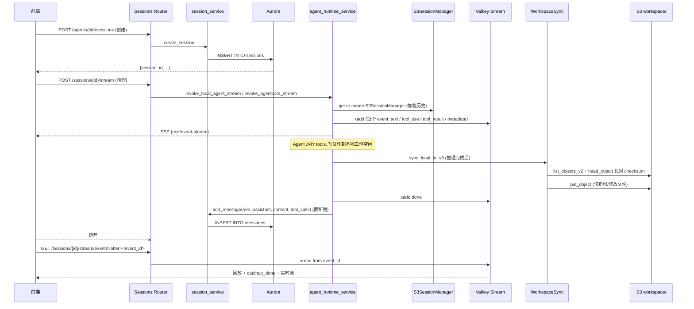

# 会话存储

## 概述

"会话存储"是 Nexus-AI 中承载一次 Agent 对话全生命周期的持久化子系统。它不是单一数据库，而是五个存储介质协作：**Aurora PostgreSQL** 放会话元数据与消息流、**Valkey Streams** 缓冲 SSE 实时事件、**S3**（`S3SessionManager`）持久化多轮对话的模型级上下文、**本地 `.cache/`** 目录承载 Agent 运行时文件、以及 **S3 workspace/** 前缀做本地 ↔ 云端同步和前端下载。

**职责边界：**

- **写入者**：`api/v2/routers/sessions.py` 负责 HTTP 入口；`api/v2/services/agent_runtime_service.py` 把 Strands SDK 的 `S3SessionManager` 注入 Agent 实例；`nexus_utils/runtime_workspace/` 为每个 `(agent_id, session_id)` 组建工作目录并推送到 S3。
- **读取者**：SSE 重连从 Valkey Stream 回放（`/sessions/{id}/stream/events`），断线追赶完成后自动切实时；前端文件预览从 S3 列表 + 预签名 URL；历史消息从 Aurora `messages` 读。
- **不做什么**：不保存 Bedrock 原始响应体；不保存 tool 输入/输出的完整内容（超过阈值会被截断写入 DynamoDB/Aurora，完整内容放到工作空间或 SSE 事件中）；不管附件上传（见 `attachment_service`）。

**主要入口：**

| 入口 | 位置 | 职责 |
|------|------|------|
| `router` (FastAPI `APIRouter`) | `api/v2/routers/sessions.py:1557` | 注册 `/api/v2/{…}/sessions/{…}` 下的所有 HTTP/SSE 端点 |
| `session_service` | `api/v2/routers/sessions.py:1543`（导入处） | Aurora 会话/消息 CRUD 门面（`create_session`、`get_session`、`list_sessions`、`list_user_sessions_with_preview`、`list_messages`、`add_message`） |
| `_get_s3_session_manager` | `api/v2/services/agent_runtime_service.py:2156` | 构造 Strands 官方 `S3SessionManager`，实现多轮对话持久化 |
| `cache_client` (Valkey 单例) | `api/v2/database/valkey.py:3411` | Streams / 缓存 / 分布式锁 / Pub-Sub |
| `WorkspaceManager` | `nexus_utils/runtime_workspace/workspace_manager.py:564` | 管理本地 `.cache/&lt;agent_id&gt;/&lt;session_id&gt;/` 目录 |
| `WorkspaceSync` | `nexus_utils/runtime_workspace/workspace_sync.py:831` | 本地 ↔ S3 双向增量同步、预签名 URL |
| `prepare_skill_envs` | `nexus_utils/runtime_workspace/skill_env.py:393` | Agent 创建时准备 Skill 的 Python / Node 运行环境 |

## 文件组织（File Layout）

| 路径 | 责任 | 依赖 |
|------|------|------|
| `api/v2/routers/sessions.py` | 10 个 HTTP/SSE 端点；SSE 重连（Valkey Stream 回放 + 追赶完成信号）；文件上传 base64 化 | `fastapi`, `session_service`, `agent_service`, `attachment_service`, `chat_task_manager`, `cache_client as _valkey`, `agent_runtime_service` |
| `api/v2/services/agent_runtime_service.py` | AgentCore / 本地 Agent 流式调用；`S3SessionManager` 缓存；事件格式解析（`_parse_stream_event`） | `boto3`, `strands.session.s3_session_manager.S3SessionManager`, `api.v2.config.settings` |
| `api/v2/database/aurora.py` | Aurora `PostgresClient` 单例；`sessions` / `messages` 表通过通用 `_insert`/`_get`/`_update`/`_list` CRUD 存取 | `psycopg`, `psycopg_pool`, `nexus_utils.config_loader` |
| `api/v2/database/valkey.py` | `CacheClient` 单例；Streams（`xadd` / `xread` / `xrange` / `xlen`）；分布式锁；Pub-Sub | `redis` (兼容 Valkey 协议) |
| `nexus_utils/runtime_workspace/__init__.py` | 模块入口，只导出 `WorkspaceManager` 与 `WorkspaceSync` | — |
| `nexus_utils/runtime_workspace/workspace_manager.py` | 本地目录管理、扫描文件元数据、读写文件、路径穿越防护 | `hashlib`, `mimetypes`, `pathlib`, `nexus_utils.config_loader` |
| `nexus_utils/runtime_workspace/workspace_sync.py` | S3 ↔ 本地增量同步；预签名 URL；在线可预览/可编辑判定；清理（批量 `delete_objects`） | `boto3`, `botocore.config.Config`, `WorkspaceManager` |
| `nexus_utils/runtime_workspace/workspace_tools.py` | 三个 `@strands.tool` 装饰的 Agent 工具：`runtime_workspace_list_files`、`runtime_workspace_read_file`、`runtime_workspace_write_file` | `strands` |
| `nexus_utils/runtime_workspace/skill_env.py` | Skill 依赖缓存；`setup_python_env` / `setup_node_env` / `prepare_skill_envs` | `subprocess`, `hashlib`, `nexus_utils.skill.storage`, `api.v2.database.db_client` |

## 五路存储总览

每条会话的数据同时分布在 5 个位置，同步关系如下：

```
                        ┌────────────────────────────────┐
                        │  HTTP / SSE (FastAPI router)   │
                        │  api/v2/routers/sessions.py    │
                        └────────────┬───────────────────┘
                                     │
        ┌────────────────────┬───────┴────────┬───────────────────┐
        ▼                    ▼                ▼                   ▼
 ┌──────────────┐   ┌──────────────────┐  ┌─────────────┐  ┌──────────────┐
 │ Aurora PG    │   │ Valkey Streams   │  │  S3 (Strands│  │ 本地 .cache/ │
 │ sessions/    │   │ nexus:chat:stream│  │ S3SessionMgr│  │ <agent>/<ses>│
 │ messages     │   │ :<session_id>    │  │ multi-turn  │  │   workspace  │
 │ (元数据+消息)│   │ (SSE 回放缓冲)   │  │ LLM 上下文  │  │   文件       │
 └──────────────┘   └──────────────────┘  └─────────────┘  └──────┬───────┘
                                                                    │ 增量
                                                                    ▼
                                                           ┌────────────────┐
                                                           │ S3 workspace/  │
                                                           │ <agent>/<ses>/ │
                                                           │ (远端只读镜像) │
                                                           └────────────────┘
```

| 介质 | Key / 路径 | TTL | 写入者 | 读取者 |
|------|------------|-----|--------|--------|
| Aurora `sessions` 表 | `session_id` 主键 | 永久 | `session_service.create_session` / `update_session` | `GET /sessions/{id}`, `list_agent_sessions`, `list_my_sessions` |
| Aurora `messages` 表 | `(session_id, message_id)` | 永久 | `session_service.add_message` | `GET /sessions/{id}/messages` |
| Valkey Stream | 由 `chat_task_manager.get_stream_key(session_id)` 产出 | 通常 30 分钟（`expire_stream(..., ttl=1800)`） | Agent 流式推理过程 | `/sessions/{id}/stream/events`（SSE 重连） |
| Valkey 锁 | 由 `chat_task_manager` 维护 | 10 分钟（`ttl=600`） | 发起推理时 `acquire_lock` | 重复发起请求时检测 |
| S3 `SESSION_STORAGE_S3_BUCKET/SESSION_STORAGE_S3_PREFIX/&lt;session_id&gt;/...` | Strands SDK 内部定义 | 永久 | `S3SessionManager`（由 Strands Agent 内部调用） | 下一轮对话自动加载历史 |
| 本地 `.cache/&lt;agent_id&gt;/&lt;session_id&gt;/` | 项目根目录 | 进程生命周期（人工 `cleanup` 或 `WorkspaceSync.cleanup`） | Agent 运行时工具（file_write、shell 等） | `WorkspaceManager.scan_files` / 工具读取 |
| S3 `workspace/&lt;agent_id&gt;/&lt;session_id&gt;/` | `attachment_s3_bucket`（默认 `nexus-ai-attachments-2026`） | 永久（清理会话时批量 `delete_objects`） | `WorkspaceSync.sync_local_to_s3` | 前端列表 + 预签名下载 |

## 会话元数据与消息（Aurora）

Aurora 的两张表通过 `PostgresClient` 的通用 CRUD 操作。虽然 `aurora.py` 没有暴露 `create_session`/`add_message` 的业务方法（这些由 `session_service` 实现），但底层依赖的 5 个原语如下：

| 方法 | 位置 | 签名 | 用途 |
|------|------|------|------|
| `_insert` | `aurora.py:2777` | `_insert(table, data) -> dict` | `INSERT … RETURNING *`，自动过滤未知列 |
| `_get` | `aurora.py:2785` | `_get(table, where, params) -> Optional[dict]` | `SELECT * … WHERE … LIMIT 1` |
| `_update` | `aurora.py:2789` | `_update(table, where, where_params, updates) -> Optional[dict]` | 自动注入 `updated_at`；`UPDATE … RETURNING *` |
| `_delete` | `aurora.py:2799` | `_delete(table, where, params) -> bool` | `DELETE FROM … WHERE …` |
| `_list` | `aurora.py:2804` | `_list(table, where, params, order_by, limit, offset) -> list` | `SELECT * [WHERE] [ORDER] [LIMIT] [OFFSET]` |

### `_filter_data` 与列名缓存

写入前所有业务方法都会调用 `_filter_data(table, data)`（`aurora.py:2762`），它只保留 `information_schema.columns` 中存在的列。结果缓存在 `_column_cache` 这个 class 级 `Dict[str, set]`。这意味着：**给 `sessions.metadata` 之类的 JSONB 字段新增内嵌键不需要迁移，但新增顶层列必须走 DDL 迁移 + 重启进程让缓存失效**。

### JSONB 包装

```python
# aurora.py:2733
@staticmethod
def _jsonb(v):
    if isinstance(v, (dict, list)):
        return Jsonb(v)
    return v
```

把 dict/list 自动包成 `psycopg.types.json.Jsonb`——调用方无需关心 PostgreSQL JSONB 与 Python dict 之间的转换。`metadata` 字段（里面藏着 `files`、`files_count`、`real_agent_id` 等）就是靠这一层透明存储的。

### 连接池参数

| 参数 | 来源 | 默认 |
|------|------|------|
| `host` | `NEXUS_AURORA_HOST` 环境变量 / `config.get('aurora.host')` | 必须配置 |
| `port` | `aurora.port` | `5432` |
| `dbname` | `aurora.database` | `nexus` |
| `user` | `aurora.username` | `nexus_admin` |
| `password` | `NEXUS_AURORA_PASSWORD` / `aurora.password` | 必须配置 |
| `sslmode` | `aurora.ssl` 为真时 `require`，否则 `prefer` | `require` |
| `min_size` | `aurora.min_connections` | `2` |
| `max_size` | `aurora.max_connections` | `20` |
| `autocommit` | 固定 | `True` |
| `row_factory` | 固定 | `dict_row` |

所有 SQL 查询通过 `self.pool.connection()` 上下文管理器，返回 `dict` 行；`_row_to_dict` 会把 `datetime` / `date` / `Decimal` 分别转成 ISO 字符串与 int/float。

## Sessions Router — 10 个端点

全部挂在 `prefix="/api/v2"` 下（由 `api/v2/main.py` 装配）。每个端点都有 `dependencies=[Depends(require_permission(...))]` 做权限校验；user_id 一律从 JWT 的 `current_user["user_id"]` 取，不信任客户端传入。

| # | Method | Path | 处理函数 | 权限 | 位置 |
|---|--------|------|----------|------|------|
| 1 | POST | `/agents/{agent_id}/sessions` | `create_session` | `session:create` | `sessions.py:1616` |
| 2 | GET | `/me/sessions` | `list_my_sessions` | `session:list` | `sessions.py:1662` |
| 3 | GET | `/agents/{agent_id}/sessions` | `list_agent_sessions` | `session:list` | `sessions.py:1696` |
| 4 | GET | `/sessions/{session_id}` | `get_session` | `session:read` | `sessions.py:1738` |
| 5 | GET | `/sessions/{session_id}/messages` | `list_messages` | `session:read` | `sessions.py:1765` |
| 6 | GET | `/sessions/{session_id}/stream/events` | `stream_events` | `agent:chat` | `sessions.py:1798` |
| 7 | GET | `/sessions/{session_id}/stream/status` | `get_stream_status` | `agent:chat` | `sessions.py:1828` |
| 8 | POST | `/sessions/{session_id}/messages` | `send_message` | `agent:chat` | `sessions.py:1913` |
| 9 | POST | `/sessions/{session_id}/upload` | `upload_files_to_session` | `agent:chat` | `sessions.py:1956` |
| 10 | POST | `/sessions/{session_id}/stream` | `stream_chat` | `agent:chat` | `sessions.py:2016` |

### 端点 1 — `create_session`

```python
@router.post("/agents/{agent_id}/sessions", response_model=SessionDetailResponse,
             dependencies=[Depends(require_permission("session:create"))])
async def create_session(
    agent_id: str = Path(..., description="Agent ID"),
    request: CreateSessionRequest = None,
    current_user: dict = Depends(get_auth_user),
):
```

- **收藏 Agent 处理**：`agent_id.startswith('fav-')` 时，从 `request.metadata.real_agent_id` 取真实 Agent ID；缺失返回 400。
- 调用 `session_service.create_session(agent_id=..., user_id=..., display_name=..., metadata=...)`。
- `user_id` 永远来自 JWT，**不信任** request 传入。

### 端点 2 — `list_my_sessions`

跨 Agent、跨会话列出当前用户最近 N 条（`limit: 1–100`，默认 50）。调用 `session_service.list_user_sessions_with_preview(user_id, limit)`。源文档注释明示：**"单条 SQL + 窗口函数聚合，避免 N+1"**。

### 端点 3 — `list_agent_sessions`

- 对 `fav-` 前缀跳过 Agent 存在性验证（收藏条目允许在真实 Agent 不可见时仍展示）。
- `is_admin = current_user.get("role") == "admin"` — 管理员看所有，普通用户过滤 `s.user_id == current_user.user_id`。

### 端点 4 / 5 — 只读详情

`get_session` 与 `list_messages` 都是简单的 `session_service.get_session` / `session_service.list_messages(session_id, limit=1000, ..., le=5000)` 透传；会话不存在返回 404。

### 端点 6 — `stream_events`（SSE 重连核心）

```python
@router.get("/sessions/{session_id}/stream/events",
            dependencies=[Depends(require_permission("agent:chat"))])
async def stream_events(
    session_id: str = Path(..., description="会话ID"),
    after: str = Query('0', description="从哪个 event_id 之后读取（断线重连用）"),
):
```

流程：

1. `stream_key = chat_task_manager.get_stream_key(session_id)`，`status = chat_task_manager.get_status(session_id)`。
2. 若 `stream_key` 为空且 `status != 'running'` → 410（`"Stream 已过期或不存在，请从消息历史加载"`），前端改走 `/messages`。
3. 否则返回 `StreamingResponse(_read_valkey_stream(stream_key, last_id=after), media_type="text/event-stream")`，强制 `Cache-Control: no-cache`、`X-Accel-Buffering: no`（Nginx 场景下禁缓冲）。

`_read_valkey_stream` 是整个重连语义的核心（`sessions.py:1844`），其中 `catchup_done` 信号是前端切 session 时一次性渲染历史再切实时流的关键：

- 心跳周期：`NEXUS_SSE_HEARTBEAT_INTERVAL`（默认 15 s）。
- 批大小：`_batch_size = 50`（`xread` 一次最多 50 条）。
- `catchup_signaled` 只发一次，两个触发条件：
  1. `xread` 首次返回空（block 超时空读 ⇒ 追赶完成）。
  2. `xread` 返回数量少于 `batch_size`（本批是尾部）。
- 空读同时会 `yield heartbeat`；若 `xlen(stream_key) == 0` 再 yield `done`。
- 事件结构：`{event, data, _event_id}`，`_event_id` 注入自 Valkey `event_id`，前端断线后用它做 `after=` 继续。

### 端点 7 — `get_stream_status`

简单查询：

```json
{
  "success": true,
  "data": {
    "session_id": "...",
    "status": "running|done|error|null",
    "stream_key": "nexus:chat:stream:<session_id> | null",
    "has_active_stream": true|false
  }
}
```

### 端点 8 — `send_message`（仅入库，不触发推理）

```python
message = session_service.add_message(
    session_id=session_id,
    role=request.role,
    content=request.content,
    metadata=metadata,   # 自动注入 files_count / files 摘要（不含 base64 data）
)
```

文件摘要字段：`[{'filename', 'content_type', 'size'}, ...]`（每项仅三字段；真正的 base64 走 `upload_files_to_session` 或 `send_message.files` 的内联数据）。

### 端点 9 — `upload_files_to_session`

每个 `UploadFile`：读取全部字节 → `base64.b64encode` → 返回 `FileUploadResponse(files=[{filename, content_type, size, data, file_id}], count, session_id)`。上传失败抛 500 且**整批回滚**（抛异常即返回，不继续处理下一个）。

**注意**：此端点返回的 base64 data 需由前端再传回 `/sessions/{id}/stream` 的 `request.files`；它并**不**把文件写入工作空间或 S3，只是一个"握手→返回 base64"通道（大文件会撑爆 DynamoDB 消息记录，推荐改走 `attachment_ids` 预签名上传——见下一节）。

### 端点 10 — `stream_chat`（真正的推理入口）

整个请求流程（关键分支）：

1. 加载 `session = session_service.get_session(session_id)` → 404 if None。
2. 从 `session.agent_id` 还原 `real_agent_id`；`fav-` 前缀从 `session.metadata.real_agent_id` 读取。
3. `agent_service.get_agent(real_agent_id)` → 404 if None。
4. **运行时类型解析**（在附件处理前，决定附件传递方式）：`sandbox_service.scheduler.resolve_runtime(agent_record, user_preference=getattr(request, "runtime_type", None))`，取 `.value`，默认回退 `"local"`。
5. **附件处理**（`request.attachment_ids` 分支，优先于内联 `files`）：
   - **sandbox 模式** (`ec2` / `agentcore`)：只通过 `attachment_service.download_attachments_to_workspace(...)` 下载到 EFS，不做 base64；`files_data` 仅含 `filename / content_type / file_size`，避免双重 S3 拉取。
   - EFS 挂载路径由 `nexus_utils.sandbox.config.efs_data_mount()` + `workspace_prefix()` + `session_id` 拼出。
6. 后续走 `invoke_agentcore_stream` 或 `invoke_local_agent_stream`（两个从 `agent_runtime_service` 导入的 async generator）。
7. SSE 格式通过 `_truncate_for_sse(text, max_length)` 节流：`SSE_TOOL_INPUT_MAX_LENGTH = 100`、`SSE_TOOL_RESULT_MAX_LENGTH = 2000`；入库时再用 `_truncate_tool_calls` 做一次更紧的裁剪（`TOOL_INPUT_MAX_LENGTH = 200`、`TOOL_RESULT_MAX_LENGTH = 500`），防止单行超出 DynamoDB 大小限制。

截断函数：

```python
# sessions.py:1569
def _truncate_for_sse(text: str, max_length: int) -> str:
    if not text or len(text) <= max_length:
        return text
    return text[:max_length] + f"... [truncated, {len(text)} chars total]"
```

## Agent Runtime — `S3SessionManager`（Strands 多轮上下文）

Strands 官方提供 `S3SessionManager`，由 `api/v2/services/agent_runtime_service.py:2156` 的 `_get_s3_session_manager(session_id)` 构造：

```python
from strands.session.s3_session_manager import S3SessionManager

session_manager = S3SessionManager(
    session_id=session_id,
    bucket=settings.SESSION_STORAGE_S3_BUCKET,
    prefix=settings.SESSION_STORAGE_S3_PREFIX,
    region_name=settings.AWS_REGION,
)
```

### 必须配置项

| 配置 | 变量 | 行为 |
|------|------|------|
| S3 桶 | `settings.SESSION_STORAGE_S3_BUCKET` | 未配置则函数返回 `None` 并 `logger.warning("... multi-turn conversation disabled")`——Agent 会继续工作，但**每轮都是无记忆的**。 |
| S3 前缀 | `settings.SESSION_STORAGE_S3_PREFIX` | 所有 session 对象都挂在 `{prefix}/{session_id}/...` 下。 |
| 区域 | `settings.AWS_REGION` | 同 S3 桶区域，减少跨区费用。 |

### 缓存策略

```python
# agent_runtime_service.py:2147
_cache_lock = threading.Lock()
_session_manager_cache: Dict[str, Any] = {}

cache_key = f"{settings.SESSION_STORAGE_S3_BUCKET}:{session_id}"
with _cache_lock:
    if cache_key in _session_manager_cache:
        return _session_manager_cache[cache_key]
```

缓存粒度 = `bucket:session_id`。**不随 Agent 切换失效**——同一个 `session_id` 在 process 生命周期内始终复用同一个 `S3SessionManager`。

### 与 Agent 实例缓存的关系

同一模块还维护了 `_agent_instance_cache`（`agent_runtime_service.py:2153`），按 **`session_id + prompt_path`** 组合做 key——这意味着修改 system prompt 会触发新实例创建，但相同 prompt 下跨轮调用复用同一个 Agent 对象（`strands.Agent`），从而复用 `S3SessionManager`。

### 并发控制相关常量

| 常量 | 来源 | 默认 | 含义 |
|------|------|------|------|
| `AGENT_CREATION_TIMEOUT` | `NEXUS_AGENT_CREATION_TIMEOUT` | `120` s | Agent 工厂构造超时 |
| `AGENT_STREAM_TIMEOUT` | `NEXUS_AGENT_STREAM_TIMEOUT` | `300` s | 单次流式推理超时，防 Bedrock 挂起 |
| `AGENT_MAX_CONCURRENCY` | `NEXUS_AGENT_MAX_CONCURRENCY` | `5` | 本地 Agent 并发上限（`asyncio.Semaphore`），防 Bedrock 限流 |

## Valkey Streams — 实时事件缓冲

`CacheClient`（`valkey.py:3112`）是 Valkey Serverless 的线程安全单例，全局实例 `cache_client`（`valkey.py:3411`）。本子系统只关心 Stream / Lock / Pub-Sub 三块。

### 两个 Redis 客户端

| 字段 | 用途 | `socket_timeout` |
|------|------|------------------|
| `_client` | 一般 KV / stream 非阻塞操作 | 5 s |
| `_stream_client` | 专用于阻塞 `XREAD(block=N)` 的连接 | 60 s — **必须大于最长 `block_ms`（30 s）+ 余量**，否则每次 block 超时都会抛 `TimeoutError` |

```python
# valkey.py:3168
self._stream_client = redis.Redis(
    host=endpoint,
    ...
    socket_timeout=60,
    retry_on_timeout=True,
)
```

### Stream API

| 方法 | 签名 | 特点 |
|------|------|------|
| `xadd` | `xadd(stream_key, fields: dict, maxlen: int = 2000) -> Optional[str]` | 非字符串字段自动 `json.dumps(cls=_CacheEncoder)`；`maxlen=2000` 做环形截断（保最新 2000 条） |
| `xread` | `xread(stream_key, last_id: str = '0', block_ms: int = 15000, count: int = 50) -> list` | 走 `stream_client`；返回 `[(event_id, {field: value}), ...]` |
| `xrange` | `xrange(stream_key, start: str = '-', end: str = '+', count: int = 100) -> list` | 范围扫描，非阻塞 |
| `xlen` | `xlen(stream_key) -> int` | 长度查询；失败返回 0（**不**抛异常） |
| `expire_stream` | `expire_stream(stream_key, ttl: int = 1800)` | 单独设 TTL（Stream 不会被 Redis 默认 EXPIRE 清理） |

### 分布式锁

```python
# valkey.py:3366
def acquire_lock(self, key: str, value: str = '1', ttl: int = 600) -> bool:
    ...
    return bool(self.client.set(key, value, nx=True, ex=ttl))

def release_lock(self, key: str):
    self.delete(key)

def get_lock_value(self, key: str) -> Optional[str]:
    ...
```

**关键陷阱**：`acquire_lock` 在 Valkey 不可用时返回 `True`（**不阻塞业务**），这意味着没有 Valkey 时所有节点都能拿到锁——生产环境务必确保 Valkey 可连。

### Pub/Sub

`publish(channel, message)` 自动 `json.dumps`（非字符串 message）；返回订阅者数量。本子系统用于**后台 Agent 完成通知**——Worker 完成推理后向 `chat:done:&lt;session_id&gt;` 之类频道 publish，SSE 循环或轮询观察者能感知 `done` 事件。

### 缓存失效辅助

| 方法 | 失效 keys |
|------|-----------|
| `invalidate_project(project_id)` | `project:dashboard:&lt;id&gt;`、`project:detail:&lt;id&gt;`、`stats:overview`、`stats:build:*`、`projects:list:*` |
| `invalidate_agent(agent_id)` | `agent:detail:&lt;id&gt;`、`stats:overview`、`agents:list:*`、`stats:agents:*` |
| `invalidate_stage(project_id)` | `project:dashboard:&lt;id&gt;` |
| `invalidate_tool(project_id)` | `tools:project:&lt;id&gt;`（如果有 id）+ `tools:*` |
| `invalidate_skill()` | `skills:*` |
| `invalidate_user(user_id)` | `user:auth:&lt;id&gt;` |
| `invalidate_stats()` | `stats:overview` + `stats:*` |

## 运行时工作空间 — `nexus_utils/runtime_workspace/`

### 设计约束

- **本地目录根**：项目根 `/ .cache/&lt;agent_id&gt;/&lt;session_id&gt;/`（可通过 `runtime_workspace.local_base_dir` 配置覆盖）。
- **S3 根**：`{s3_prefix}/{agent_id}/{session_id}/`，其中 `s3_prefix` 默认 `workspace/`（配置 `runtime_workspace.s3_prefix`）。
- **排除目录**：`nexus_ai_internal_attachments_temp/`——附件由 `attachment_service` 独立管理，不参与工作空间扫描/同步/列表。

### `WorkspaceManager` — 本地目录

构造参数（`workspace_manager.py:572`）：

| 参数 | 类型 | 默认 | 说明 |
|------|------|------|------|
| `agent_id` | `str` | 必填 | Agent ID |
| `session_id` | `str` | 必填 | 会话 ID |
| `config` | `Optional[Dict[str, Any]]` | `_get_config()` | 读 `nexus_ai_config.runtime_workspace` |
| `workspace_path` | `Optional[str]` | `None` | 显式路径；不传则拼 `.cache/&lt;agent&gt;/&lt;session&gt;/` |

方法汇总：

| 方法 | 签名 | 行为 |
|------|------|------|
| `ensure_workspace` | `() -> Path` | `mkdir(parents=True, exist_ok=True)` |
| `get_workspace_path` | `() -> str` | `str(self.workspace_path)` |
| `exists` | `() -> bool` | `workspace_path.exists()` |
| `scan_files` | `() -> List[Dict[str, Any]]` | `rglob('*')` 收集 `path / size / content_type / checksum / modified_at`，跳过 `nexus_ai_internal_attachments_temp/` |
| `read_file` | `(relative_path) -> Optional[bytes]` | 路径穿越校验（`resolve().relative_to`）→ `read_bytes()` |
| `write_file` | `(relative_path, content: bytes) -> bool` | 同上校验 + 自动创建父目录 + `write_bytes` |
| `delete_file` | `(relative_path) -> bool` | 同上校验 + `unlink()` |
| `cleanup` | `() -> bool` | `shutil.rmtree(workspace_path)` |
| `get_workspace_size` | `() -> int` | `sum(stat.st_size)` |
| `_calculate_checksum` | `(file_path: Path) -> str` | 8 KB 分块 SHA256；异常返回 `""` |

**MIME 补充**：模块导入时补 `text/markdown(.md)`、`text/yaml(.yaml/.yml)`、`text/x-python(.py)`、`text/typescript(.ts)`、`text/javascript(.js)`。

**路径穿越防护**示例（`workspace_manager.py:677`）：

```python
try:
    file_path.resolve().relative_to(self.workspace_path.resolve())
except ValueError:
    logger.warning(f"Path traversal attempt: {relative_path}")
    return None
```

### `WorkspaceSync` — 本地 ↔ S3 双向同步

构造参数同 `WorkspaceManager`，内部持有一个 `WorkspaceManager` 实例（`workspace_sync.py:858`）。

S3 配置（延迟初始化）：

| 字段 | 来源 | 默认 |
|------|------|------|
| `_bucket` | `nexus_config.attachment_s3_bucket` | `"nexus-ai-attachments-2026"` |
| `_s3_prefix` | `config.s3_prefix` | `"workspace/"` |
| `_presigned_url_expiry` | `config.presigned_url_expiry` | `3600` s |
| `_inline_max_size` | `config.inline_content_max_size` | `1048576` bytes (1 MB) |
| `region` | `aws_config.aws_region_name` | `"us-west-2"` |
| `signature_version` | 固定 | `s3v4` |
| `addressing_style` | 固定 | `virtual` |
| `retries` | 固定 | `max_attempts=3, mode='adaptive'` |

**S3 key 构造**：

```python
# workspace_sync.py:913
def _s3_key(self, relative_path: str) -> str:
    prefix = self._s3_prefix.rstrip('/')
    return f"{prefix}/{self.agent_id}/{self.session_id}/{relative_path}"
```

#### 核心方法

| 方法 | 签名 | 行为 |
|------|------|------|
| `sync_local_to_s3` | `() -> Dict[str, Any]` | 基于 `checksum` 比对增量上传；返回 `{uploaded, skipped, failed, total}` |
| `_get_s3_checksums` | `() -> Dict[str, str]` | `list_objects_v2` + 每 key `head_object` 取 `Metadata.checksum` |
| `sync_s3_file_to_local` | `(relative_path) -> bool` | 前端编辑保存后回写本地 |
| `list_files` | `() -> List[Dict[str, Any]]` | 从 S3 列，附带预签名下载 URL / 可预览 / 可编辑标记 |
| `get_file_content` | `(relative_path) -> Optional[Tuple[bytes, str]]` | 从 S3 读内容 + content_type |
| `save_file_content` | `(relative_path, content: bytes, content_type: Optional[str] = None) -> bool` | 写 S3 后，若 `config.sync_on_edit == True`（默认）再写本地 |
| `generate_upload_url` | `(relative_path, content_type: str) -> Optional[str]` | 前端直传 S3 的预签名 PUT URL |
| `_generate_presigned_url` | `(s3_key, method, extra_params=None) -> Optional[str]` | 统一预签名生成（method = `get_object` / `put_object`） |
| `cleanup` | `() -> Dict[str, Any]` | 本地 `rmtree` + 分批 `delete_objects`（每批 1000） |

#### 中文文件名的 Content-Disposition

`list_files` 每个对象都会生成带 `ResponseContentDisposition` 的预签名 URL（强制下载行为）。中文文件名需要 RFC 5987 编码，否则 S3 返回 400：

```python
# workspace_sync.py:1096
filename = rel_path.rsplit('/', 1)[-1] if '/' in rel_path else rel_path
try:
    filename.encode('iso-8859-1')
    disposition = f'attachment; filename="{filename}"'
except UnicodeEncodeError:
    from urllib.parse import quote
    disposition = f"attachment; filename*=UTF-8''{quote(filename)}"
```

#### 可预览 / 可编辑判定

`_is_previewable(content_type, filename='')`（`workspace_sync.py:1289`）：

- `text/*` → 可预览
- `image/*` → 可预览
- `application/json` / `application/xml` → 可预览
- `text/html` → 可预览
- `application/pdf` → 可预览
- 扩展名白名单：`{md, json, yaml, yml, xml, csv, log, py, js, ts, jsx, tsx, html, css, sql, sh, bash, txt, cfg, ini, toml, png, jpg, jpeg, gif, webp, svg, bmp, pdf}`

`_is_editable(content_type)`（`workspace_sync.py:1327`）：

- `text/*` → 可编辑
- `application/json`、`application/xml`、`application/javascript` → 可编辑
- 其余 → 不可编辑

#### 增量同步算法

```text
sync_local_to_s3():
    local_files = manager.scan_files()         # 含每文件 SHA256 checksum
    s3_checksums = _get_s3_checksums()          # S3 对象 Metadata.checksum

    for file in local_files:
        if s3_checksums[file.path] == file.checksum:
            skipped += 1
        else:
            put_object(Bucket, Key=_s3_key(file), Body=content,
                       ContentType=..., Metadata={'checksum': file.checksum})
            uploaded += 1
```

**注意**：`_get_s3_checksums` 会对每个对象额外 `head_object`——对数千文件工作空间是 O(N) 的调用；未来优化点是把 checksum 放入 ListObjectsV2 的 `Tagging` 或缓存到 Valkey。

## Agent 工具 — `nexus_utils/runtime_workspace/workspace_tools.py`

三个 `@strands.tool` 装饰的函数会自动注册为 Agent 工具（当 `WorkspaceManager` 被激活时）：

| 工具 | 签名 | 返回 |
|------|------|------|
| `runtime_workspace_list_files` | `(workspace_path: str, prefix: str = "") -> str` | JSON `{workspace, file_count, files: [{path, size_bytes, last_modified}]}` |
| `runtime_workspace_read_file` | `(workspace_path: str, file_path: str, max_bytes: int = 100000) -> str` | 文件内容（UTF-8，`errors='replace'`），超过 `max_bytes` 时追加 `... [truncated: ...]` |
| `runtime_workspace_write_file` | `(workspace_path: str, file_path: str, content: str, encoding: str = "utf-8") -> str` | JSON `{status, message, size_bytes}` 或 `{status: 'error', message}` |

**路径穿越统一防护**（`_safe_resolve`，`workspace_tools.py:1369`）：

```python
abs_path = os.path.normpath(os.path.join(workspace_path, relative_path))
if not abs_path.startswith(os.path.normpath(workspace_path)):
    return ''
return abs_path
```

**注意**：工具通过 `workspace_path` 参数显式传入；Agent 要从 system prompt 的 "Runtime Workspace" 段落读取路径，否则工具返回 `Error: workspace_path is required`。

## Skill 运行环境 — `skill_env.py`

在 Agent 创建时为每个关联 Skill 准备依赖，Agent 本身无需感知。

### 公开入口

```python
# skill_env.py:393
def prepare_skill_envs(
    skill_ids: List[str],
    workspace_path: Optional[str] = None,
) -> Dict[str, Any]:
    """
    返回 {
        'skills': {skill_id: {skill_path, python_bin, node_path, ...}},
        'prompt_snippet': str,
    }
    """
```

流程（每个 Skill）：

1. `skill_storage.ensure_local(sid, skill_type, skill_name)` — 下载/更新 Skill 文件到本地。
2. `setup_python_env(skill_dir)` — 如果有 `requirements.txt`/`scripts/requirements.txt` 或 SKILL.md 里有 `pip install ...`，创建 `.venv` 并安装；否则返回 `None`。
3. `setup_node_env(skill_dir)` — 如果有 `package.json` 或 SKILL.md 里有 `npm install ...`，执行 `npm install --prefix &lt;skill_dir&gt;`。
4. 把安装路径写进 `info['python_bin']` / `info['node_path']`，以及 prompt 片段。

### 依赖缓存机制

| 文件 | 位置 | 内容 |
|------|------|------|
| `.python_deps_hash` | `&lt;skill_dir&gt;/` | `requirements.txt` 的 SHA256（或 SKILL.md 提取到的包列表拼接后的 SHA256） |
| `.node_deps_hash` | `&lt;skill_dir&gt;/` | `package.json` 的 SHA256（或提取到的 npm 包列表） |

读取时通过 `_is_deps_cached(skill_dir, hash_file, current_hash)` 比对，匹配则跳过整个安装步骤。

### Python venv 创建（优先 uv，回退 `venv`）

```python
# skill_env.py:264
def _create_venv(venv_dir: Path, python_bin: Path) -> bool:
    try:
        proc = subprocess.run(
            ["uv", "venv", str(venv_dir), "--python", "python3"],
            capture_output=True, text=True, timeout=30,
        )
        if proc.returncode == 0:
            return True
    except (FileNotFoundError, subprocess.TimeoutExpired):
        pass
    # 回退到标准 venv
    import venv as _venv_mod
    _venv_mod.create(str(venv_dir), with_pip=True)
```

同样 `_pip_install` 先试 `uv pip install`，失败再 `&lt;python_bin&gt; -m pip install`，两者都是 300 s 超时。

### SKILL.md 提取规则

| 语言 | 正则（来自源码） |
|------|------------------|
| npm | `r'npm\s+install\s+(?:-g\s+)?([a-zA-Z0-9@/_-]+(?:\s+[a-zA-Z0-9@/_-]+)*)'` |
| pip | `r'pip\s+install\s+(?:-[A-Za-z]+\s+)*([a-zA-Z0-9_-]+(?:\s+[a-zA-Z0-9_-]+)*)'` |

提取到的包名会去重 + 排序。如果 Skill 没有 `package.json` 但有 npm 指令，`setup_node_env` 会自动生成一个最小 `package.json`：

```json
{
  "name": "skill-<skill_dir.name>-deps",
  "version": "1.0.0",
  "private": true,
  "dependencies": {"<pkg>": "latest"}
}
```

### Prompt 片段格式

当至少有一个 Skill 返回环境信息时，`prepare_skill_envs` 会拼出如下段落注入 Agent system prompt：

```text
## Skill Runtime Environments
The following Skills have their dependencies pre-installed in their own directories.
Use the absolute paths below when running Skill scripts.
Your file operations (file_write, shell, etc.) work in your workspace as usual.
**Important**: Do NOT run `npm install` or `pip install` yourself — dependencies are ready.

- **<skill_name>** (id: `<sid>`):
  Skill path: `<skill_dir>`
  Python scripts: `<python_bin> <skill_dir>/scripts/SCRIPT.py [args]`
  Node.js: When running JS files that require Skill packages, prefix with `NODE_PATH=<node_modules>`
  Example: `NODE_PATH=<node_modules> node your_script.js`
```

## 数据流：一次完整对话



## 扩展点（Extending）

### 新增一个会话级存储介质

1. 在 `api/v2/services/` 下新建一个门面（例如 `audit_service.py`），仿照 `session_service` 的函数签名对外导出。
2. 需要连接池 → 复用 `api.v2.database.aurora.pg_client`；需要键值 → 复用 `api.v2.database.valkey.cache_client`。
3. 在 `api/v2/routers/sessions.py` 顶部 import 并在合适端点里调用（不要直接把 boto3 写进 router）。

### 新增一类 SSE 事件

1. 生产侧：在 `agent_runtime_service` 里的流式 yield 里加 `{"event": "&lt;new_type&gt;", ...}`，同时 `cache_client.xadd(stream_key, {"type": "&lt;new_type&gt;", "data": json.dumps(...)})`。
2. 消费侧：`_read_valkey_stream` 会把 `_event_id` 注入到每个事件；前端按 `event` 字段分发。
3. 不要破坏 `done` 语义——`_read_valkey_stream` 看到 `event_type == 'done'` 会 `return`。

### 新增 Agent 工具访问工作空间

- 在 `nexus_utils/runtime_workspace/workspace_tools.py` 里用 `@tool` 装饰新函数，**必须**第一个参数是 `workspace_path: str` 并经过 `_safe_resolve` 校验。
- 让工具返回 JSON 字符串以便 Strands 规范地透传给 LLM。
- 注册时机：Agent 工厂构造时会把 `runtime_workspace_*` 工具注入到 Agent tools 列表——新工具加进 `workspace_tools.py` 后需要由 Agent 工厂显式引用（不要依赖 `__init__.py` 隐式导入）。

### 调整 SSE 重连批大小 / 心跳周期

两者都在 `api/v2/routers/sessions.py:_read_valkey_stream`：

- `_batch_size = 50` 硬编码；改大会减少 `xread` 次数但让 `catchup_done` 触发条件难满足。
- `NEXUS_SSE_HEARTBEAT_INTERVAL`（env，默认 15 s）——如果前端代理会在 30 s 空闲断开连接，要降到 10 s 以下。

### 扩展 S3 同步的过滤规则

- 当前跳过 `nexus_ai_internal_attachments_temp/`，硬编码在 `WorkspaceManager.scan_files`（`workspace_manager.py:643`）与 `WorkspaceSync.list_files`（`workspace_sync.py:1087`）两处——修改需同步更新。
- 要支持 `.gitignore` 风格的规则，推荐在 `WorkspaceManager._should_include(relative_path)` 里集中判定并从两处调用。

### 替换 `S3SessionManager` 为自定义存储

- Strands SDK 允许通过 Agent 构造参数传入任意实现 `SessionManager` 协议的对象。
- 把 `agent_runtime_service._get_s3_session_manager` 改成返回你的实现即可；缓存策略（`_session_manager_cache` + `_cache_lock`）完全通用。
- 仍要尊重"无 `SESSION_STORAGE_S3_BUCKET` 返回 None 降级为无记忆模式"的约定，便于本地联调。

## 常见调试 / 故障排查

| 现象 | 可能原因 | 诊断 |
|------|----------|------|
| `GET /sessions/{id}/stream/events` 返回 410 | `chat_task_manager` 里无 stream_key 且 status != running（已过期） | 前端改走 `GET /sessions/{id}/messages` 载入历史 |
| SSE 一直不发 `catchup_done` | `xread` 每次都返回满 50 条（`_batch_size`） | 临时调大 `_batch_size` 或等待流自然收敛；检查是否有循环工具调用把 stream 写爆 |
| `WARNING: SESSION_STORAGE_S3_BUCKET not configured, multi-turn conversation disabled` | 未设置 S3 桶 | 检查 `settings.SESSION_STORAGE_S3_BUCKET`；不配置会导致每轮都无上下文 |
| Aurora 写 session 时 `_filter_data` 日志 `跳过未知列 {...}` | `sessions` / `messages` 表缺列 | 跑迁移脚本新增列，重启进程刷新 `_column_cache` |
| `ERROR: Valkey 连接失败，缓存层禁用` | endpoint 未配置 / SSL 证书问题 | 检查 `NEXUS_VALKEY_ENDPOINT`；`acquire_lock` 在 Valkey 不可用时返回 True，**会放过所有并发请求** |
| `Failed to get S3 checksums` WARN | IAM 缺 `s3:ListBucket` / `s3:GetObject` | 检查执行角色；`sync_local_to_s3` 继续跑但会把所有文件当新增重传 |
| 前端下载中文文件名 S3 返回 400 | Content-Disposition 未 RFC 5987 编码 | 走 `_generate_presigned_url` 路径（`list_files` 自动处理）；直接拼 URL 的代码要补 `filename*=UTF-8''&lt;quote&gt;` |
| 路径穿越日志 `Path traversal attempt: ...` | Agent 工具收到 `../` 路径 | 查 prompt/工具调用；`read_file`/`write_file`/`delete_file` 都会直接返回失败，不会造成副作用 |
| Skill venv 已创建但包没装 | 先创建 venv 成功但 `pip install` 失败 | `grep "[skill_env] pip install failed"` 查 stderr 前 500 字符；删掉 `&lt;skill_dir&gt;/.python_deps_hash` 强制重装 |
| `NODE_PATH` 指向错误目录 | Skill 的 `node_modules` 被手动删过但没清 hash | 删 `&lt;skill_dir&gt;/.node_deps_hash` + `node_modules`，下次 `prepare_skill_envs` 会重装 |
| `IncompleteRead` 日志（AgentCore） | Bedrock 流被上游提前关闭 | `agent_runtime_service._sync_invoke` 的读线程会尝试解析 `e.partial`，保留已有数据并结束流 |

### 诊断命令

```bash
# 查看某 session 的 Stream 长度
valkey-cli XLEN "<stream_key>"

# 回放最后 20 条事件
valkey-cli XRANGE "<stream_key>" - + COUNT 20

# Aurora 查会话
psql -h $NEXUS_AURORA_HOST -U nexus_admin -d nexus \
  -c "SELECT session_id, agent_id, user_id, created_at FROM sessions WHERE session_id = '<id>'"

# Aurora 统计某 session 消息数
psql -c "SELECT COUNT(*), MIN(created_at), MAX(created_at) FROM messages WHERE session_id = '<id>'"

# 本地工作空间大小
du -sh .cache/<agent_id>/<session_id>/

# S3 workspace/ 列
aws s3 ls s3://$ATTACHMENT_BUCKET/workspace/<agent_id>/<session_id>/ --recursive | wc -l

# 清理所有 Skill venv 缓存（强制下次重装）
find /path/to/skills -maxdepth 2 -name '.python_deps_hash' -delete
find /path/to/skills -maxdepth 2 -name '.node_deps_hash' -delete
```

## 延伸阅读

- [API 层架构](./api-layer.md) — 认证中间件、`settings`、`pg_client` / `cache_client` 单例装配。
- [Worker 架构](./worker.md) — 后台 Agent 构建与流水线，使用同一 Aurora / Valkey。
- Strands SDK 官方 `S3SessionManager`：`strands.session.s3_session_manager`——本项目只做一层缓存包装，具体 S3 对象结构由 SDK 定义。
